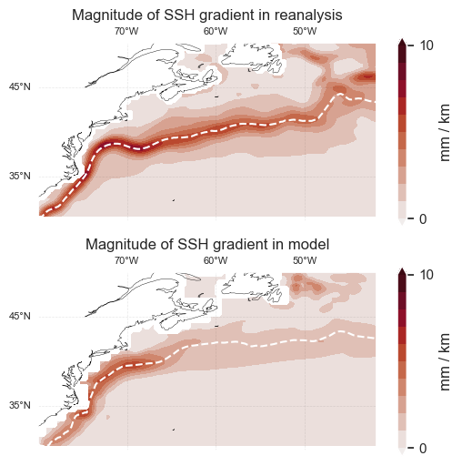
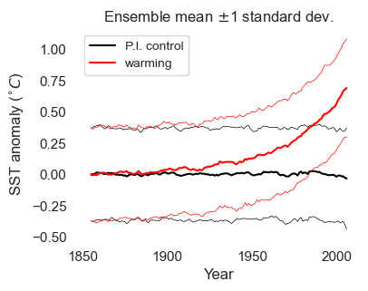

# Climate data analysis @ WHOI: a tutorial
The purpose of this tutorial is to provide practical guidance on how to analyze gridded climate data stored on WHOI's servers using python. The tutorial is designed to take place over ~6 hour-long sessions, and is split into two parts. In the first part, we'll step through a template for assessing climate change: (i) defining a climate index, (ii) evaluating a model's ability to represent processes which influence this index, and (iii) assessing long-term changes in the index by comparing a model's historical and pre-industrial control simulations. ~~In the second part, we'll see how these principles are applied in state-of-the-art research by reproducing results from a recent study of the Azores High~~<sup>1</sup>.

<sup>1</sup>Cresswell-Clay, N. et al. "Twentieth-century Azores High expansion unprecedented in the past 1,200 years". *Nat. Geosci.* 15, 548–553 (2022).

## 7/18 updates
- ~~We'll look at large ensembles today, using the following notebook: [scripts/2_cmip_tutorial.ipynb](scripts/2_cmip_tutorial.ipynb)~~
- Here's a link to the (new) notebook we'll use today: [scripts/whoi_mip.ipynb](scripts/whoi_mip.ipynb). We'll compare Woods Hole 2m-temperature simulations in the "1pctCO2" scenario of a few CMIP models. See the [Task List](docs/task_list.md) for solutions to the "<mark>To-do</mark>"s in the notebook.


## 7/17 updates
- Here's a link to the (new) notebook we'll use today: [scripts/1.5_detection_tutorial.ipynb](scripts/1.5_detection_tutorial.ipynb). In this notebook we'll compare Woods Hole 2m-temperature between pre-industrial control and historical simulations
- We'll look at large ensembles tomorrow, using the following notebook: [scripts/2_cmip_tutorial.ipynb](scripts/2_cmip_tutorial.ipynb)

## 7/16 updates
- See the [results](results) folder to see the output of running the each of the tutorial notebooks. For example, to see the output of scripts/0_xarray_tutorial.ipynb, navigate to the folder [results/0_xarray_tutorial](results/0_xarray_tutorial) and open the markdown file [0_xarray_tutorial.md](results/0_xarray_tutorial/0_xarray_tutorial.md).
- See the [FAQ](docs/FAQ.md) page for a possible solution to the "NetCDF: HDF error" that many people have been getting when trying to open data from the CMIP6 server

## 7/11 updates
- See the [Task List](docs/task_list.md) for a list of checkpoints for each tutorial.
- *"How should I use the tutorial notebooks?"* The notebooks are structured into three parts: filepaths / imports, examples, and "To-do"s. To use the notebooks:
    1. (__required__) Update and execute the code cells with filepaths / imports.
    2. (__optional__) Run the code in the examples section (everything between imports and "To-dos")
    3. Complete the "To-do"s at the end of the notebook (see [Task List](docs/task_list.md) for detailed checkpoints)

## Outline
Date | Topic | Notebook
-- | -- | --
7/9 | Connecting to the [CMIP5](cmip5.whoi.edu)<sup>*</sup> and [CMIP6](cmip6.whoi.edu) data servers | N/A (see instructions [below](#Accessing-the-climate-data-servers))
7/10 | Pre-processing using [```xarray```](https://docs.xarray.dev/en/stable/)  | [0_xarray_tutorial.ipynb](scripts/0_xarray_tutorial.ipynb)
7/11 | Defining a climate index | [0_xarray_tutorial.ipynb](scripts/0_xarray_tutorial.ipynb)
7/16 | Climate model validation | [1_model_validation_tutorial.ipynb](scripts/1_model_validation_tutorial.ipynb)
7/17 | Detecting climate change using models  | [1.5_detection_tutorial.ipynb](scripts/1.5_detection_tutorial.ipynb)
7/18 | Model intercomparison using WHOI's servers  | [whoi_mip.ipynb](scripts/whoi_mip.ipynb)

<sup>*</sup>CMIP = Coupled Model Intercomparison Project   

## Set up

### Getting the code
- Option 1: if you're comfortable with Github, fork [the repository](https://github.com/ktcarr/whoi-climate-data-tutorial/) (see [this page](https://docs.github.com/en/pull-requests/collaborating-with-pull-requests/working-with-forks/fork-a-repo) for more on forking), then clone it to your PC.
- Option 2: Download the repository as a .zip file: go to [the repository home page](https://github.com/ktcarr/whoi-climate-data-tutorial/), then click "Code -> Download ZIP".

### Virtual environment
1. Set up mamba or conda (if not already). To set up, download and install miniforge following the instructions here: https://github.com/conda-forge/miniforge.
2. Navigate to the project home folder (e.g., with ```cd ~/whoi-climate-data-tutorial```)
3. Create a conda/mamba environment for the project with: ```mamba create -p ./envs``` and activate the environment with ```conda activate ./envs```
4. Next, install necessary packages in the environment with:<sup>3,4</sup>
    - (Mac/Linux) ```mamba env update -p ./envs --file environment.yml``` 
    - (Windows)  ```mamba env update -p ./envs --file environment_no_cdo.yml``` 
5. Install custom module (```src```) in the environment with ```pip install -e .```

<sup>3</sup>The CDO package, used for regridding data in this tutorial, is not available for Windows through conda (thanks to Haakon Pihlaja for catching this). This may cause the ```mamba env update``` command to "hang" when used with [environment.yml](environment.yml), the full list of packages (which includes CDO). While [it's possible to use CDO on Windows](https://code.mpimet.mpg.de/projects/cdo/wiki/Win32), it's probably not worth setting this up just for the tutorial. Instead, use the package list *without* CDO, [environment_no_cdo.yml](environment_no_cdo.yml). 

<sup>4</sup>If you're using conda and the ```conda install ...``` / ```conda env update ...``` commands are taking a long time, you could try [updating the solver to "libmamba"](https://www.anaconda.com/blog/a-faster-conda-for-a-growing-community). If this doesn't work, you could also try setting the channel priority to flexible, with ```conda config --set channel_priority flexible``` (thanks to Lilli Enders for suggesting this).

### Running the code (locally)
1. Navigate to project folder
2. Activate virtual environment (```conda activate ./envs```)
3. Start jupyter lab with by typing ```jupyter lab``` in terminal / command window

### Accessing the climate data servers
Note: to access the data, you must be on the WHOI network (i.e., on the WHOI wifi or connected by VPN).

#### Option 1 (preferred): mounting the network file system
- Windows and (non-Mac) Linux users: follow [online instructions for CMIP5](http://cmip5.whoi.edu/?page_id=40) or [for CMIP6](http://cmip6.whoi.edu/?page_id=50).
- Mac users: for CMIP6, open Finder, then select "Go" from the top menu bar and click "Connect to Server". Then, enter ```smb://vast.whoi.edu/proj/cmip6```. If prompted, enter your WHOI username (*without* "@whoi.edu") and password. Note the default mount location for the server is ```/Volumes/data```. For CMIP5, use the same process but with the following server address: ```smb://cmip5.whoi.edu```.

#### Option 2: downloading the data and running locally
__For reanalysis and model data used in the tutorial__:
- Download data from the [shared Google Drive folder](https://drive.google.com/drive/folders/1V-aHzoYYUrU6d5ExnxEORiZxeAAisx_e?usp=drive_link)

__For other (CMIP6) model output__:
- Go to [http://cmip6.whoi.edu/search](http://cmip6.whoi.edu/search).
- Click on the the "HTTP" link in the "Files" column for a dataset you'd like to download.
- On the next page, select individual files to download.
- (optional) Save these files to a folder called ```data``` in this project.

#### Option 3: running in the cloud
- Go to [https://colab.research.google.com/](https://colab.research.google.com/)
- In Google Colab, click "File -> Open notebook -> Upload" and select one of the tutorial notebooks. 
- Go to the [shared Google Drive folder](https://drive.google.com/drive/folders/1V-aHzoYYUrU6d5ExnxEORiZxeAAisx_e?usp=drive_link)
- Click the three dots next to the "climate-data" folder and click "Organize -> Add shortcut", then select "My Drive"
- Note: __if using Google Colab, the regridding components of the tutorial will not work__, owing to package compatibility issues (cannot import the ```xesmf``` package in Colab, possibly related to [this issue](https://github.com/conda-forge/esmf-feedstock/issues/91)).


## Description of high-level folders & files:
Folder/file | Description
-- | --
```scripts``` | contains ```.ipynb``` notebooks used in tutorial
```src``` | custom module containing functions used in the tutorials
```setup.py``` | file needed to import ```src``` module 
```environment.yml``` | list of packages needed for tutorial
```.gitignore``` | list of files and extensions ```git``` should ignore

## A preview:
### 1. Pre-processing: detrending and correlation
<p float="left">
 
</p>

### 2. Model validation: Gulf Stream in ORAS5 and CESM2
<p float="left">
 
</p>

### 3. Climate change assessment (toy stochastic model)
<p float="left">
 
</p>

## Other potentially useful links
- A guide for how to organize research code for non-computer scientists: [The Good Research Code Handbook](https://goodresearch.dev/index.html).
- [Description of CMIP naming conventions, including variant ID](https://wcrp-cmip.org/cmip-data-access/)


