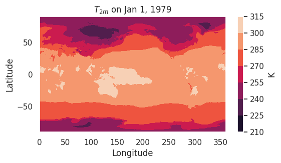
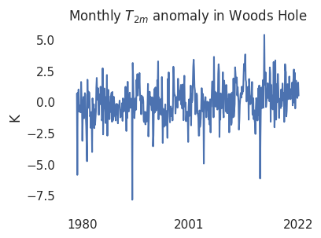
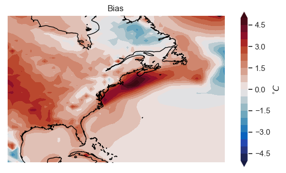
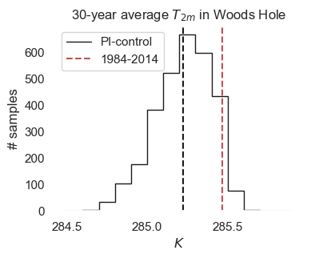
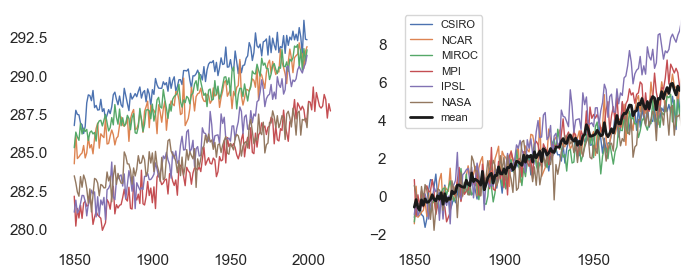

# Table of contents
- [Thu, Jul 11: defining a climate index](#Thursday,-Jul-11:-defining-a-climate-index)
- [Tue, Jul 16: model validation](#Tuesday,-Jul-16:-model-validation)
- [Wed, Jul 17: climate change detection](#Wed,-Jul-17:-Climate-change-detection-(1/2))
- [Thu, Jul 18: WHOI model inter-comparison](#Thu,-Jul-18:-WHOI-model-inter-comparison)

# Thursday, Jul 11: defining a climate index

## Overview:
Part 1. [Set filepaths and import packages](#Part-1:-Setting-filepaths-and-importing-packages)  
Part 2: [Open the ERA5 temperature data](#Part-2:-Open-the-data)  
Part 3: [Compute a climate index (monthly temperature anomaly in Woods Hole)](#Part-3:-Defining-the-index)

## Goal figures:
<p float="left">
 
</p>

<p float="left">
 
</p>

## Part 1: Setting filepaths and importing packages
1. __Open the [0_xarray_tutorial.ipynb](../scripts/0_xarray_tutorial.ipynb) notebook__. You can do this using your own virtual environment or in the cloud using Google Colab (see [instructions for Colab](#Google-Colab-instructions)).
2. __Run the 1<sup>st</sup> code cell__ (under the header "Check if we're running in Google Colab"):
```python
try:
    import google colab
    ...
    IN_COLAB = True

except:
    IN_COLAB = False

```
The purpose of this cell is to detect if we're using Google Colab and, if so, link the notebook with Google Drive. If you're using Colab, you may get an error message about the kernel crashing after the cell finishes executing – if so, run the cell again; it seems to work for me the second time.

3. __Update the filepath ```era_t2m_path``` in the 2<sup>nd</sup> code cell.__ This is the path to the 2m-temperature data from the ERA5 reanalysis. If you're using Colab (```IN_COLAB``` is True), you shouldn't have to change anything. If you're not using Colab, you need to modify the filepath to match the location of the data (if you're on Windows, you may have issues with backslashes; see [note below](#Windows-filepaths)).
```python
if IN_COLAB:

    ### This is the path to use with Google Colab.
    ### You shouldn't need to change it.
    era5_t2m_path = ...

else:

    ### Modify this path if you're *not* on Google Colab.
    ### It should be the path to the data on your computer.
    era5_t2m_path = ...
```

3b. (optional) Update the other filepaths in the 2<sup>nd</sup> code cell, ```era5_slp_path``` and ```miroc6_path```. This will allow you to run all of the code in the notebook (e.g., illustrating correlation between variables and regridding), but isn't necessary for today's goal.

4. __Run the 2<sup>nd</sup> code cell__ (filepaths, from above)  and __3<sup>rd</sup> code cell__ (package imports)

5. (optional) Run the rest of the code in the notebook.

### Part 2: Open the data
6. Scroll down to the end of the notebook, and __create a new code cell__.
7. __Get the "pattern" of filenames in the ERA5 dataset__ (there's one file per year). One way to do this is ```file_pattern = os.path.join(era5_t2m_path, "*.nc")```. This pattern will match any files in the ERA5 folder which end in ```.nc``` (file extension for NetCDF files).  To check this worked, you can print out a list of matched files with ```glob.glob(file_pattern)```.
8. __Open the dataset__, with ```t2m = xr.open_mfdataset(file_pattern)["t2m"]```.
9. __Plot the first timestep__, with ```plt.contourf(t2m.longitude, t2m.latitude, t2m.isel(time=0))```


### Part 3: Defining the index
9. __Get 2m temperature near Woods Hole__ with ```t2m_WH = t2m.sel(latitude=41.5, longitude=288.5)```
10. __Define climate index as temperature anomaly in Woods Hole__: first, compute the monthly averages. Then subtract the monthly averages from the original timeseries. For example,
```python
t2m_WH_monthly_avg = t2m_WH.groupby("time.month").mean()
climate_index = t2m_WH.groupby("time.month") - t2m_WH_monthly_avg
```
  
11. (optional): write a function which combines steps 9 and 10:
```python
    def get_climate_index(global_t2m):
        """
        Input: 'global_t2m' is a 3-D DataArray (lon,lat,time)
    
        Output: 'climate_index' is a 1-D DataArray (time)
        """
    
        ## To-do
        climate_index = ...
    
        return climate_index
```
12. __Plot the result__ with ```plt.plot(climate_index.time, climate_index)```


# Tuesday, Jul 16: model validation

## Overview:
Part 1. [Set filepaths and import packages](#Part-1:-Setting-filepaths)  
Part 2: [Open the data](#Part-2:-Open-data)  
Part 3: [Subset data in time and space](#Part-3:-Subset-data-in-time-and-space)  
Part 4: [Plot the bias](#Part-4:-Plot-the-bias)

## Goal figures:
<p float="left">
 
</p>


## Part 1: Setting filepaths
1. __Open the [1_model_validation_tutorial.ipynb](../scripts/1_model_validation_tutorial.ipynb) notebook__. You can do this using your own virtual environment or in the cloud using Google Colab (see [instructions for Colab](#Google-Colab-instructions)).
2. __Run the 1<sup>st</sup> code cell__ (under the header "Check if we're running in Google Colab"):
```python
try:
    import google colab
    ...
    IN_COLAB = True

except:
    IN_COLAB = False

```
The purpose of this cell is to detect if we're using Google Colab and, if so, link the notebook with Google Drive. If you're using Colab, you may get an error message about the kernel crashing after the cell finishes executing – if so, run the cell again; it seems to work for me the second time.

3. __Update the filepaths ```era_t2m_path``` and ```cesm_t2m_path``` in the 2<sup>nd</sup> code cell.__ These are the paths to the 2m-temperature data from the ERA5 reanalysis and the CESM2 climate model's historical run, respectively. If you're using Colab (```IN_COLAB``` is True), you shouldn't have to change anything. If you're not using Colab, you need to modify the filepath to match the location of the data (if you're on Windows, you may have issues with backslashes; see [note below](#Windows-filepaths)).
```python
if IN_COLAB:

    ### This is the path to use with Google Colab.
    ### You shouldn't need to change it.
    era5_t2m_path = ...
    cesm_t2m_path = ...

else:

    ### Modify this path if you're *not* on Google Colab.
    ### It should be the path to the data on your computer.
    era5_t2m_path = ...
    cesm_t2m_path = ...
```

3b. (optional) Update the other filepaths in the 2<sup>nd</sup> code cell, ```oras_path``` and ```cesm_zos_path```. This will allow you to run all of the code in the notebook (e.g., comparing Gulf Stream position in the ORAS5 reanalysis and the CESM2 climate model), but isn't necessary for today's goal.

4. __Run the 2<sup>nd</sup> code cell__ (filepaths, from above)  and __3<sup>rd</sup> code cell__ (package imports)

5. (optional) Run the rest of the code in the notebook.

### Part 2: Open data
6. Scroll down to the end of the notebook, and __create a new code cell__.

7. __Open the ERA5 data__. Recall from the previous tutorial that each year of data is saved in a separate file. Therefore, start by getting the "file pattern" with ```file_pattern = os.path.join(era5_t2m_path,"*.nc")```. Next, open the data with ```T2m_era = xr.open_mfdataset(file_pattern)["t2m"]```.

8. __Open the CESM2 data__. The CESM2 data is all contained with a single file called ```tas_Amon_CESM2_historical_r1i1p1f1_gn_185001-201412.nc```. To open it, combine the filepath and filename with:
```python
cesm_fname = "tas_Amon_CESM2_historical_r1i1p1f1_gn_185001-201412.nc"
cesm_t2m_path_full = os.path.join(cesm_t2m_path, cesm_fname)
T2m_cesm = xr.open_dataset(cesm_t2m_path_full)["tas"]
```

### Part 3: Subset data in time and space
9. __Subset both datasets in time for the overlapping period__ (1979–2014). To do this, define a "time_range" object, ```time_range=["1979","2014"]```, and select the range for both datasets:
```python
T2m_era = T2m_era.sel(time=slice(*time_range))
T2m_cesm = T2m_cesm.sel(time=slice(*time_range))
```

10. __Subset the CESM2 data in space__, trimming to the North Atlantic. Subset for the longitude range ```lon_range = [258, 318]``` and the latitude range ```lat_range = [20, 60]```. Do the actual subsetting with ```T2m_cesm = T2m_cesm.sel(lon=slice(*lon_range), lat=slice(*lat_range))```

11. __Regrid the ERA5 data to match the (trimmed) CESM2 data__. First, let's rename ERA5's spatial coordinates from "longitude" and "latitude" to "lon" and "lat" (to match CESM2): ```T2m_era = T2m_era.rename({"latitude":"lat","longitude":"lon"})```. Then, interpolate the ERA5 data onto the CESM2 grid with: ```T2m_era = T2m_era.interp({"lat":T2m_cesm.lat, "lon":T2m_cesm.lon})```.

#### Part 4: Plot the bias
10. __Compute the bias__, defined here as the difference between the mean states: ```bias = T2m_cesm.mean("time") - T2m_era.mean("time")```.

11. __Plot the bias__, using the following code:
```python
## Blank canvas for plotting
fig = plt.figure(figsize=(7,4))

## add background map
ax = fig.add_subplot(projection=ccrs.PlateCarree())

## draw coastlines
ax.coastlines()

## set plot boundaries
ax.set_extent([*lon_range, *lat_range], crs=ccrs.PlateCarree())

## Plot the data (filled contour plot)
plot_data = ax.contourf(
    bias.lon, 
    bias.lat, 
    bias, 
    cmap="cmo.balance", # name of colormap
    levels=np.arange(-5,5.5,.5), # contour levels
    transform=ccrs.PlateCarree(), # 'transform' arg. required for plotting on map
    extend="both", # specifies how to handle out-of-range values in colorbar
)

## Add a colorbar and title
fig.colorbar(plot_data, label=r"$^{\circ}C$")
ax.set_title("Bias")

## render the plot
plt.show()
```

# Wed, Jul 17: Climate change detection (1/2)
In this tutorial, most of the code is already written – we'll fill in the important parts (labeled with "<mark>To-do</mark>"s in the accompanying notebook, [1.5_detection_tutorial.ipynb](../scripts/1.5_detection_tutorial.ipynb)). Below are detailed instructions for how to complete the <mark>To-do</mark>s and run the entire notebook (note: if the "<mark>To-do</mark>"s aren't completed in the notebook, the code will not run).

## Overview:
Part 1. [Set filepaths and import packages](#Part-1:-Set-filepaths)  
Part 2: [Open the CESM data](#Part-2:-Open-CESM-data-and-compute-index)  
Part 3: [Draw random samples from PI-control](#Part-3:-Draw-random-samples-from-PI-control)  
Part 4: [Make a histogram](#Part-4:-Make-a-histogram)

## Goal figures:
<p float="left">
 
</p>
<p float="left">
 
</p>

## Part 1: Set filepaths
1. __Open the [1.5_detection_tutorial.ipynb](../scripts/1.5_detection_tutorial.ipynb) notebook__. You can do this using your own virtual environment or in the cloud using Google Colab (see [instructions for Colab](#Google-Colab-instructions)).
2. __Run the 1<sup>st</sup> code cell__ (under the header "Check if we're running in Google Colab"):
```python
try:
    import google colab
    ...
    IN_COLAB = True

except:
    IN_COLAB = False

```
The purpose of this cell is to detect if we're using Google Colab and, if so, link the notebook with Google Drive. If you're using Colab, you may get an error message about the kernel crashing after the cell finishes executing – if so, run the cell again; it seems to work for me the second time.

3. <mark>To-do</mark>: __Update the filepaths ```hist_path``` and ```pico_path``` in the 2<sup>nd</sup> code cell.__ These are the paths to the 2m-temperature data for CESM2 climate model's "historical" and "pre-industrial control" runs, respectively. If you're using Colab (```IN_COLAB``` is True), you shouldn't have to change anything. If you're not using Colab, you need to modify the filepath to match the location of the data (if you're on Windows, you may have issues with backslashes; see [note below](#Windows-filepaths)).
```python
if IN_COLAB:

    ### This is the path to use with Google Colab.
    ### You shouldn't need to change it.
    hist_path = ...
    pico_path = ...

else:

    ### Modify this path if you're *not* on Google Colab.
    ### It should be the path to the data on your computer.
    hist_path = ...
    pico_path = ...
```

## Part 2: Open CESM data and compute index
4. __Run code cells in this section__: these are all things we've covered already, so we'll breeze through it. *You shouldn't need to modify any code for this section to run*. In short, the code in this section does the following things: trims the data, loads it into memory, and compute the Woods Hole "climate index" (2m-temperature in the grid cell closest to Woods Hole). After running the code in this section, we'll have two xr.DataArrays representing timeseries of annual-mean 2m-temperature in the historical and pre-industrial control simulations, respectively. In the code, these variables are called ```T2m_WH_hist``` and ```T2m_WH_pico```; each are xr.DataArrays with 1-dimension (```"year"```).

## Part 3: Draw random samples from PI-control
5. <mark>To-do</mark>: We're going to estimate the probability distribution for 
the PI-control run by drawing lots of random samples (with replacement). Let's start by __writing a function which draws a single random sample__ of length ```nyears``` and computes the mean. For example,
```python
def get_sample_mean(data, nyears):
    """
    Function draws a random sample from given dataset,
    and averages over period.
    Args:
        'data': xr.DataArray to draw samples from 
        'nyears': integer specifying how many years in each sample
        
    Returns:
        'sample_mean': xr.DataArray containing mean of single sample
    """

    ## Select start/end years for the sample
    possible_start_years = data.year[:-nyears]
    start_year = rng.choice(possible_start_years)
    end_year = start_year + nyears

    ## Select the sample
    sample = data.sel(year=slice(start_year, end_year))

    ## compute sample mean
    sample_mean = sample.mean("year")

    return sample_mean
```

6. <mark>To-do</mark>: Next, __write a function which draws multiple samples__ and computes the mean of each. For example,
```python
def get_sample_means(data, nsamples, nyears=30):
    """
    Function draws multiple random samples, by 
    repeatedly calling the 'get_sample_mean' function.
    Args:
        'data': xr.DataArray to draw samples from
        'nsamples': number of samples to draw
        'nyears': number of years in each sample

    Returns:
        'sample_means' xr.DataArray containing mean for each sample
        
    """

    ## initialize empty list to hold sample means
    sample_means = []

    ## do the simulations inside a loop
    for _ in range(nsamples):

        ## select a random sample
        sample_means.append(get_sample_mean(data, nyears))

    ## concatenate list into xarray
    sample_means = xr.concat(sample_means, dim="sample")
    
    return sample_means
```

7. <mark>To-do</mark>: Finally, __draw 3,000 random samples__ from the pre-industrial control output. For example,
```python
sample_means = get_sample_means(data=T2m_WH_pico, nsamples=3000)
```

## Part 4: Make a histogram 
8. __Compute the histogram__, using the ```np.histogram``` function (we'll manually specify the bins for the histogram):
```python
bin_width = 0.1
bin_edges = np.arange(284.5, 286, bin_width)
histogram_pico, _ = np.histogram(sample_means, bins=bin_edges)
```

9. <mark>To-do</mark>: __Compute index over last 30 years of historical simulation__, for comparison to the PI control. For example, compute this value with ```T2m_last30 = T2m_WH_hist.isel(year=slice(-30,None)).mean()```

10. __Plot the histogram and stats__, using the following code (for example):
```python
## blank canvas for plotting
fig, ax = plt.subplots(figsize=(4, 3))

## plot the histogram
ax.stairs(values=histogram_pico, edges=bin_edges, color="k", label="PI-control")

## plot mean value for the PI control
ax.axvline(sample_means.mean(), c="k", ls="--")

## plot mean over last ~30 years
ax.axvline(T2m_last30, c="r", ls="--", label=r"1984-2014")

## label the plot
ax.set_ylabel("# samples")
ax.set_xlabel(r"$K$")
ax.set_title(r"30-year average $T_{2m}$ in Woods Hole")
ax.legend()

plt.show()
```

# Thu, Jul 18: WHOI model inter-comparison
Items that need to be completed for the code to run are marked with <mark>To-do</mark>.

## Goal figure:
<p float="left">
 
</p>

0. __Open the [whoi_mip.ipynb](../scripts/whoi_mip.ipynb) notebook__.

1. __Preliminaries__: run "Google Colab" and "import" cells.

2. <mark>To-do:</mark> __Set filepaths.__

3. __Define climate index function__. This index – 2m-temperature near Woods Hole – is the same one we've been using for the last several tutorials.

4. <mark>To-do:</mark> __Compute climate index on each dataset__. We want a list, where each item in the list is the climate index timeseries for a given model. Here's my solution:
```python
## empty list to hold result
T2m_idx = []

## loop through each (model, filepath) pair
for model, fp in fp_dict.items():

    ## get file pattern
    file_pattern = os.path.join(fp, "*.nc")

    ## open dataset and append to list
    T2m_idx.append(
        xr.open_mfdataset(
            os.path.join(fp, "*.nc"),
            use_cftime=True,
            mask_and_scale=False,
            preprocess=WH_index,
        )["tas"]
    )
```

5. <mark>To-do:</mark> __Convert the list ```T2m_idx``` into a single ```xr.DataArray```__ and load it into memory. Before using ```xr.concat``` to concatenate the items in the list, we need to make sure their ```"year"``` coordinate matches, so we'll start by writing a function which resets the year for each dataset to start in 1850. My solution is here:
```python
def reset_year(T2m):
    """Function to reset year to start at 1850"""

    ## get new time index
    updated_year = np.arange(1850, 1850 + len(T2m.year))

    ## add to array
    T2m["year"] = updated_year

    return T2m


## concatenate in dataset
T2m_idx = [reset_year(x) for x in T2m_idx]
T2m_idx = xr.concat(T2m_idx, dim=pd.Index(models, name="model"), coords="minimal")

## Drop unnecessary coordinates
T2m_idx = T2m_idx.drop_vars(["height", "lon", "lat"])

## Load into memory
start = time.time()
T2m_idx.load()
end = time.time()
print(end - start)
```

6. __Get a normalized version of the data__, called ```T2m_idx_norm```, to make it easier to compare datasets (basically, remove the bias). We'll do this by subtracting the mean of the first 30 years for each model. My solution is:
```python
## normalize by removing mean of first 30 years
T2m_idx_baseline = T2m_idx.isel(year=slice(None, 30)).mean("year")
T2m_idx_norm = T2m_idx - T2m_idx_baseline
```

7. __Plot the result__, two different ways. First, plot the non-normalized index for each dataset. Then, plot the normalized dataset and ensemble mean. Here's my solution:
```python
fig, axs = plt.subplots(1, 2, figsize=(8, 3))

## first, plot the raw data; then, plot the normalized data
for i, data in enumerate([T2m_idx, T2m_idx_norm]):

    ## loop through each model
    for model in data.model:

        axs[i].plot(data.year, data.sel(model=model), label=model.item(), lw=1)

## plot ensemble mean
axs[1].plot(data.year, data.mean("model"), label="mean", lw=2, c="k")
axs[1].set_xlim([None, 1999])

## add legend
axs[1].legend(prop={"size": 8})

plt.show()
```


## Windows filepaths
Python reads backslashes (```\```) as escape characters. To avoid issues when specifying filepaths, you could try the ```Path``` function from the ```pathlib``` module (see this [blog post](https://medium.com/@ageitgey/python-3-quick-tip-the-easy-way-to-deal-with-file-paths-on-windows-mac-and-linux-11a072b58d5f) for some examples). The idea is to use only *forward* slashes (```/```) in the string; the ```Path``` function will convert the string to the correct form. For example, if the Windows filepath to the data uses *back* slashes, "C:\data\file.nc", you would use *forward* slashes in the string you pass to ```pathlib.Path```:
```python
import pathlib
era5_t2m_path = pathlib.Path("C:/data/file.nc")
```
 
## Google Colab instructions
- Go to [https://colab.research.google.com/](https://colab.research.google.com/)
- In Google Colab, click "File -> Open notebook -> Upload" and select one of the tutorial notebooks. 
- Go to the [shared Google Drive folder](https://drive.google.com/drive/folders/1V-aHzoYYUrU6d5ExnxEORiZxeAAisx_e?usp=drive_link)
- Click the three dots next to the "climate-data" folder and click "Organize -> Add shortcut", then select "My Drive"
- Note: __if using Google Colab, the regridding components of the tutorial will not work__, owing to package compatibility issues (cannot import the ```xesmf``` package in Colab, possibly related to [this issue](https://github.com/conda-forge/esmf-feedstock/issues/91)).