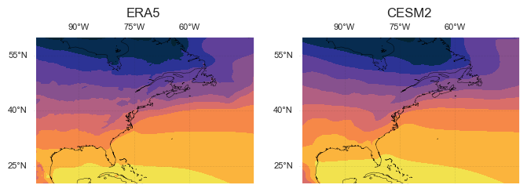
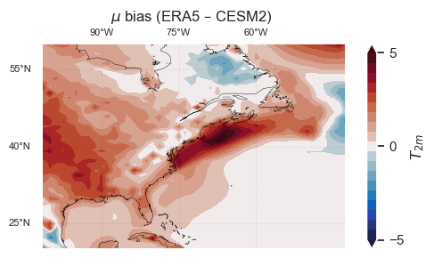
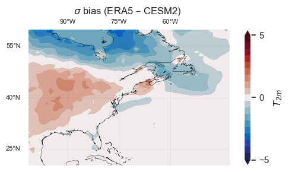
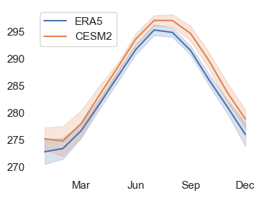
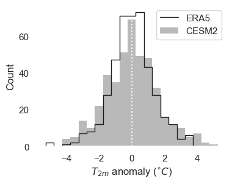
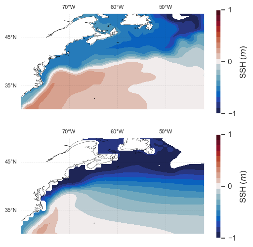
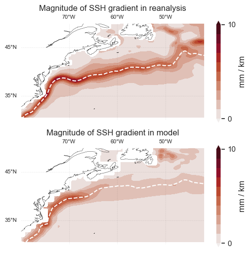

# Overview: model validation

The goal of this tutorial is to provide an example of model validation using data on WHOI's CMIP servers. By "model validation", we mean checking that a given climate model represents the key features of a process or region in a reasonable way. To perform this check, we compare the model's statistics to that of observations or reanalysis for an overlapping period (e.g., the period 1950-present). When doing a climate change analysis, the purpose of this validation is to provide confidence that we can trust the model's *future* projections for the process/region of interest (for which we don't have any observations to compare it to). For example, if we're interested in using a model to estimate future temperature changes in Woods Hole, we might want to start by checking whether the model accurately represents the mean and standard deviation of temperature in Woods Hole. Examples of more "advanced" features to compare between the model and observations might include the mean position of the Jet Stream, which impacts weather in Woods Hole, or the correlation between Woods Hole temperature and El Niño events.

In this tutorial, we'll go through an abbreviated version of this example, comparing Woods Hole temperature variability between a reanalysis product (ERA5) and a global climate model (CESM2). We'll also look at an oceanic example where the model does an arguably worse job of representing the most relevant physical processes: motivated by the question "will the Gulf Stream shift north with climate change?", we'll assess the CESM2 model's representation of Gulf Stream position.

[__Your task:__ Evaluate a climate model's ability to represent your climate index](#To-do:-validate-a-climate-model). 

## Check if we're running in Google Colab
If you are running in Google Colab, you may have to run the cell below twice because the kernel crashes; I'm not sure why this happens.


```python
## check if we're in Colab
try:
    import google.colab

    ## install package that allows us to use mamba in Colab
    !pip install -q condacolab
    import condacolab

    condacolab.install()

    ## install extra packages to colab environment
    !mamba install -c conda-forge python=3.10.13 cmocean xesmf cartopy cftime cartopy

    ## connect to Google Drive (will prompt you to ask for permissions)
    from google.colab import drive

    drive.mount("/content/drive")

    ## flag telling us the notebook is running in Colab
    IN_COLAB = True

except:
    IN_COLAB = False
```

## Filepaths
__To run this notebook, you'll need to update the filepaths below__, which specify the location of the data (otherwise, you'll get a ```FileNotFoundError``` message when you try to open the data). These filepaths will differ for Mac vs. Windows users and depend on how you've accessed the data (e.g., mounting the WHOI file server or downloading the data).


```python
if IN_COLAB:

    ## filepaths for 2m-Temperature data
    era5_t2m_path = "/content/drive/My Drive/climate-data/era5/2m_temperature"
    cesm_t2m_path = "/content/drive/My Drive/climate-data"

    ## filepaths for SSH data
    oras_path = "/content/drive/My Drive/climate-data/oras"
    cesm_zos_path = "/content/drive/My Drive/climate-data"

else:

    ## filepaths for 2m-temperature data
    era5_t2m_path = (
        "/Volumes/cmip6/data/era5/reanalysis/single-levels/monthly-means/2m_temperature"
    )
    cesm_t2m_path = (
        "/Volumes/cmip6/data/cmip6/CMIP/NCAR/CESM2/historical/r1i1p1f1/Amon/tas/gn/1"
    )

    ## filepaths for SSH data
    oras_path = "/Volumes/cmip6/data/ocean_reanalysis/ORAS5/oras5/monthly/global-reanalysis-phy-001-031"
    cesm_zos_path = (
        "/Volumes/cmip6/data/cmip6/CMIP/NCAR/CESM2/historical/r1i1p1f1/Omon/zos/gn/1"
    )
```

## Imports


```python
import xarray as xr
import numpy as np
import pandas as pd
from tqdm import tqdm
import matplotlib.pyplot as plt
import cmocean
import seaborn as sns
import glob
import cftime
import cartopy.crs as ccrs
import matplotlib.ticker as mticker
import matplotlib.dates as mdates
import os

## set plotting style
sns.set(rc={"axes.facecolor": "white", "axes.grid": False})

## initialize random number generator
rng = np.random.default_rng()
```

## Example 1/2: Woods Hole temperature

### Load data

First, a function to trim the data to the North Atlantic


```python
## function to subset longitude/latitude
def trim_to_north_atl(x):
    """trims data to the North Pacific region"""

    ## lon/lat boundaries for region to subset
    lon_range = [258.5, 318.5]
    lat_range = [60, 20]
    # latitude=41.5, longitude=288.5

    ## trim the data
    x_trimmed = x.sel(longitude=slice(*lon_range), latitude=slice(*lat_range))

    return x_trimmed
```

Load in ERA5 reanalysis data.  


```python
## Get list of files in the folder
file_list = glob.glob(os.path.join(era5_t2m_path, "*.nc"))

## Load in the data
T2m_era = xr.open_mfdataset(file_list, preprocess=trim_to_north_atl)["t2m"]
T2m_era = T2m_era.load();
```

Load in CESM2 data  


```python
cesm_fname = "tas_Amon_CESM2_historical_r1i1p1f1_gn_185001-201412.nc"
T2m_cesm = xr.open_dataset(os.path.join(cesm_t2m_path, cesm_fname))["tas"]

## rename lon/lat to match ERA5
T2m_cesm = T2m_cesm.rename({"lon": "longitude", "lat": "latitude"})

## reverse latitude coordinate, so that it matches ERA5
latitude_reversed = T2m_cesm.latitude.values[::-1]
T2m_cesm = T2m_cesm.reindex({"latitude": latitude_reversed})

## trim to N. Atlantic
T2m_cesm = trim_to_north_atl(T2m_cesm)

## load to memory
T2m_cesm.load();
```

    /Users/theo/research/cmip-tutorial/envs/lib/python3.12/site-packages/xarray/conventions.py:286: SerializationWarning: variable 'tas' has multiple fill values {1e+20, 1e+20} defined, decoding all values to NaN.
      var = coder.decode(var, name=name)


Trim both datasets to overlapping period (1979-2014)


```python
T2m_era = T2m_era.sel(time=slice(None, "2014"))
T2m_cesm = T2m_cesm.sel(time=slice("1979", None))

## for convenience, set T2m_cesm's time to match T2m_era
T2m_cesm["time"] = T2m_era.time
```

### Plot climatology (mean state)
As a first step, let's plot the mean state in the reanalysis and model.


```python
## First, a generic plot setup function
def plot_setup(ax, lon_range, lat_range, xticks, yticks, scale):
    """
    Create map background for plotting spatial data.
    Arguments:
        - ax: Matplotlib object containing everything in the plot.
            (I think of it as the plot "canvas")
        - lon_range/lat_range: 2-element arrays, representing plot boundaries
        - xticks/yticks: location for lon/lat labels
        - scale: number which controls linewidth and fontsize

    Returns a modified 'ax' object.
    """

    ## specify transparency/linewidths
    grid_alpha = 0.1 * scale
    grid_linewidth = 0.5 * scale
    coastline_linewidth = 0.3 * scale
    label_size = 8 * scale

    ## crop map and plot coastlines
    ax.set_extent([*lon_range, *lat_range], crs=ccrs.PlateCarree())
    ax.coastlines(linewidth=coastline_linewidth)

    ## plot grid
    gl = ax.gridlines(
        draw_labels=True,
        linestyle="--",
        alpha=grid_alpha,
        linewidth=grid_linewidth,
        color="k",
        zorder=1.05,
    )

    ## add tick labels
    gl.bottom_labels = False
    gl.right_labels = False
    gl.xlabel_style = {"size": label_size}
    gl.ylabel_style = {"size": label_size}
    gl.ylocator = mticker.FixedLocator(yticks)
    gl.xlocator = mticker.FixedLocator(xticks)

    return ax, gl


## Next, a function to plot the North Atlantic
def plot_setup_north_atl(ax, scale=1):
    """Create map background for plotting spatial data.
    Returns modified 'ax' object."""

    ## specify range and ticklabels for plot
    lon_range = [-102.5, -42.5]
    lat_range = [60, 20]
    xticks = [-90, -75, -60]
    yticks = [25, 40, 55]

    ax, gl = plot_setup(ax, lon_range, lat_range, xticks, yticks, scale)

    return ax, gl


## utility function to make levels for colorbar
def make_cb_range(amp, delta):
    """Make colorbar_range for cmo.balance
    Args:
        - 'amp': amplitude of maximum value for colorbar
        - 'delta': increment for colorbar
    """
    return np.concatenate(
        [np.arange(-amp, 0, delta), np.arange(delta, amp + delta, delta)]
    )
```


```python
## specify colorbar levels
levels = np.arange(266, 306, 4)

## make plot
fig = plt.figure(figsize=(8, 4))

for i, (data, label) in enumerate(zip([T2m_era, T2m_cesm], ["ERA5", "CESM2"]), start=1):

    ## ERA
    ax = fig.add_subplot(1, 2, i, projection=ccrs.PlateCarree())
    ax, gl = plot_setup_north_atl(ax)
    ax.set_title(f"{label}")

    ## plot data
    plot = ax.contourf(
        data.longitude,
        data.latitude,
        data.mean("time"),
        cmap="cmo.thermal",
        levels=levels,
        extend="both",
    )

plt.show()
```


    

    


### Plot bias
To compare temperature at the grid-point level, let's interpolate the reanalysis onto the model's longitude/latitude grid. To compute the mean bias, subtract the reanalysis mean from the model mean. We'll also compute the "bias" in standard deviations by subtracting the reanalysis' standard deivation from that of the model.


```python
## Regrid ERA5 and look at difference
T2m_era_regrid = T2m_era.interp(
    {"latitude": T2m_cesm.latitude, "longitude": T2m_cesm.longitude}
)

## get difference between means
bias = T2m_cesm.mean("time") - T2m_era_regrid.mean("time")

## get difference between std. devs.
bias_std = T2m_cesm.std("time") - T2m_era_regrid.std("time")
```

Next, plot the difference between the means. Note the huge bias off the coast of the northeast U.S.!


```python
## make plot
fig = plt.figure(figsize=(6, 3))
ax = fig.add_subplot(projection=ccrs.PlateCarree())
ax, gl = plot_setup_north_atl(ax)
ax.set_title(r"$\mu$ bias (ERA5 – CESM2)")

## plot data
plot = ax.contourf(
    bias.longitude,
    bias.latitude,
    bias,
    cmap="cmo.balance",
    levels=make_cb_range(5, 0.5),
    extend="both",
)

cb = fig.colorbar(plot, ticks=[-5, 0, 5], label=r"$T_{2m}$")
plt.show()
```


    

    


Plot difference b/n standard deviations


```python
## make plot
fig = plt.figure(figsize=(6, 3))
ax = fig.add_subplot(projection=ccrs.PlateCarree())
ax, gl = plot_setup_north_atl(ax)
ax.set_title(r"$\sigma$ bias (ERA5 – CESM2)")

## plot data
plot = ax.contourf(
    bias_std.longitude,
    bias_std.latitude,
    bias_std,
    cmap="cmo.balance",
    levels=make_cb_range(5, 0.5),
    extend="both",
)

cb = fig.colorbar(plot, ticks=[-5, 0, 5], label=r"$T_{2m}$")
plt.show()
```


    

    


### Get $T_{2m}$ near Woods Hole
Next, we'll look at the model's representation of temperature variability in Woods Hole. To do this, we'll estimate Woods Hole temperature by interpolating from the closest grid cells.


```python
T2m_era_wh = T2m_era.interp(latitude=41.5, longitude=288.5)
T2m_cesm_wh = T2m_cesm.interp(latitude=41.5, longitude=288.5)
```

### Plot seasonal cycle
Let's check how the model represents the seasonal cycle of temperature:


```python
def plot_clim(ax, x, label):
    """plot seasonal cycle and standard deviation for variable"""

    ## compute stats
    mean = x.groupby("time.month").mean()
    std = x.groupby("time.month").std()

    ## plot them
    mean_plot = ax.plot(mean.month, mean, label=label)

    ## specify style of bounds:
    ax.fill_between(
        mean.month, mean + std, mean - std, color=mean_plot[0].get_color(), alpha=0.2
    )

    return ax


fig, ax = plt.subplots(figsize=(4, 3))
ax = plot_clim(ax, T2m_era_wh, label="ERA5")
ax = plot_clim(ax, T2m_cesm_wh, label="CESM2")
ax.legend()
ax.set_xticks([3, 6, 9, 12], labels=["Mar", "Jun", "Sep", "Dec"])
plt.show()
```


    

    


### Plot histograms
So far, we've quantified "variability" by computing the mean and standard deviation. These metrics completely describe the shape of a Gaussian (or "normal") distribution, but the statistics may not be Gaussian (one *non*-normal example is the probability distribution for daily precipitation). To check for differences in the shape of the $T_{2m}$ distribution (e.g., does the reanalysis distribution have wider "tails"?), let's compare histograms of Woods Hole temperature between the reanalysis and model.

Because we care about deviations from the mean in this case, let's remove the mean and trend from the timeseries in both reanalysis and observations. We'll do this by grouping the data by month, and removing a linear trend from each group (so that we compute separate trends for Jan, Feb, ..., Dec). 


```python
def get_trend(data, dim="time"):
    """Get linear trend for an xr.dataarray along specified dimension"""

    ## Get coefficients for best fit
    polyfit_coefs = data.polyfit(dim=dim, deg=1)["polyfit_coefficients"]

    ## Get best fit line (linear trend in this case)
    trend = xr.polyval(data[dim], polyfit_coefs)

    return trend


def detrend(data, dim="time"):
    """remove linear trend along specified dimension"""

    return data - get_trend(data, dim="time")


def detrend_by_month(data):
    """function detrends data for each month separately"""
    return data.groupby("time.month").map(detrend)


## detrend each time series by month
T2m_era_wh_detrend = detrend_by_month(T2m_era_wh)
T2m_cesm_wh_detrend = detrend_by_month(T2m_cesm_wh)
```

Next, plot the histograms


```python
def plot_histogram_comparison(ax, samples0, samples1, label0=None, label1=None):
    """
    Compute two histograms, one each for samples0 and samples1.
    Plot the results on the specified ax object, and label histograms
    'label0' and 'label1', respectively.
    """

    ## First, make the histograms.
    # specify histogram bins
    bin_width = 0.5
    bin_edges = np.arange(-5.25, 5.25 + bin_width, bin_width)

    # compute histograms
    hist0, _ = np.histogram(samples0, bins=bin_edges)
    hist1, _ = np.histogram(samples1, bins=bin_edges)

    ## plot histograms
    ax.stairs(values=hist0, edges=bin_edges, color="k", label=label0)
    ax.stairs(
        values=hist1,
        edges=bin_edges,
        color="k",
        label=label1,
        fill=True,
        alpha=0.3,
    )

    ## label plot
    ax.set_ylabel("Count")
    ax.set_xlabel(r"$T_{2m}$ anomaly ($^{\circ}C$)")

    return ax
```


```python
fig = plt.figure(figsize=(4, 3))
ax = fig.add_subplot()
ax = plot_histogram_comparison(
    ax, T2m_era_wh_detrend, T2m_cesm_wh_detrend, label0="ERA5", label1="CESM2"
)
ax.axvline(0, ls=":", c="w")
ax.legend()
plt.show()
```


    

    


## Example 2/2: Gulf Stream position
In this example, we'll assess the CESM2 model's representation of Gulf Stream position, motivated by an interest in determining whether the Gulf Stream position will shift in a warmer climate$^{1,2}$. To do this, we'll compare the CESM2 model to the ORAS5 reanalysis product. We'll look at each data product's representation of sea surface height (SSH) gradients in the North Atlantic, a proxy for Gulf Stream transport. Loosely speaking, the Gulf Stream follows contours of SSH, with equal volume transport between contours (so that the velocity is larger between tightly-packed contours). The gradient of SSH measures how tightly packed the contours are, so we can think of the gradient as a proxy for Gulf Stream strength.

$^{1}$Todd, R. E. & Ren, A. S. Warming and lateral shift of the Gulf Stream from in situ observations since 2001. Nat. Clim. Chang. 13, 1348–1352 (2023).  
$^{2}$Yang, H. et al. Poleward Shift of the Major Ocean Gyres Detected in a Warming Climate. Geophysical Research Letters 47, (2020).

### Load data

Load ORAS5 reanalysis data. Note that we're extracting a variable abbreviated ```zos_oras```, the "sea surface height above geoid".


```python
oras_file_pattern = os.path.join(
    oras_path, "global-reanalysis-phy-001-031-grepv2-monthly_*.nc"
)
zos_oras = xr.open_mfdataset(oras_file_pattern)
zos_oras = zos_oras["zos_oras"]
zos_oras.load();
```

Load in CESM2 data


```python
cesm_zos_filename = os.path.join(
    cesm_zos_path, "zos_Omon_CESM2_historical_r1i1p1f1_gn_185001-201412.nc"
)
zos_cesm = xr.open_dataset(cesm_zos_filename)
zos_cesm = zos_cesm["zos"]
zos_cesm = zos_cesm.load();
```

    /Users/theo/research/cmip-tutorial/envs/lib/python3.12/site-packages/xarray/conventions.py:286: SerializationWarning: variable 'zos' has multiple fill values {1e+20, 1e+20} defined, decoding all values to NaN.
      var = coder.decode(var, name=name)


### Regrid CESM to match ORAS5

We'll use the xesmf package for this


```python
import xesmf as xe
```

For ease of comparison, let's regrid the CESM2 data to match ORAS5.


```python
regridder = xe.Regridder(
    ds_in=zos_cesm, ds_out=zos_oras, method="bilinear", periodic=False
)
zos_cesm = regridder(zos_cesm)
```

Try using CDO if ```xesmf``` doesn't work


```python
## specify "target" grid
target_grid = zos_oras.isel(time=0, drop=True)
target_grid.to_netcdf("target_grid.nc")

## Get text file description of the grid (needed for regridding)
!cdo griddes target_grid.nc > target_grid.txt

## Do the regridding with CDO
!cdo -O remapbil,target_grid.txt {cesm_zos_filename} zos_cesm_regridded.nc

## remove temporary files
!rm target_grid.txt target_grid.nc

## Load in regridded data
zos_cesm = xr.open_dataset("zos_cesm_regridded.nc")["zos"]
```

### Plot mean SSH field in reanalysis and model
First, a function to plot the Gulf Stream region:


```python
## Next, a function to plot the North Atlantic
def plot_setup_GS(ax, scale=1):
    """Create map background for plotting spatial data.
    Returns modified 'ax' object."""

    ## specify range and ticklabels for plot
    lon_range = [-80, -42]
    lat_range = [30, 50]
    xticks = [-70, -60, -50]
    yticks = [35, 45]

    ax, gl = plot_setup(ax, lon_range, lat_range, xticks, yticks, scale)

    return ax, gl
```

Next, make the plots


```python
fig = plt.figure(figsize=(6, 6))
ax = fig.add_subplot(2, 1, 1, projection=ccrs.PlateCarree())

## ORAS5
ax, gl = plot_setup_GS(ax)
oras_plot = ax.contourf(
    zos_oras.longitude,
    zos_oras.latitude,
    zos_oras.mean("time"),
    cmap="cmo.balance",
    levels=make_cb_range(1, 0.1),
)
cb = fig.colorbar(oras_plot, ticks=[-1, 0, 1], label=r"SSH ($m$)")

## CESM
ax = fig.add_subplot(2, 1, 2, projection=ccrs.PlateCarree())
ax, gl = plot_setup_GS(ax)
cesm_plot = ax.contourf(
    zos_cesm.longitude,
    zos_cesm.latitude,
    zos_cesm.mean("time"),
    cmap="cmo.balance",
    levels=make_cb_range(1, 0.1),
)
cb = fig.colorbar(cesm_plot, ticks=[-1, 0, 1], label=r"SSH ($m$)")

plt.show()
```


    

    


### Identifying Gulf Stream position

As discussed above, we can think of the SSH gradient as a proxy for velocity. Therefore, we can attempt to locate the Gulf Stream in the data as the local maximum in SSH gradient. Below, we write functions to do this: ```grad``` computes the SSH gradient, ```get_grad_mag``` computes the magnitude of the gradient, and ```get_GS_yposn``` identifies the "y-position" (latitude) of the Gulf Stream at each longitude on the grid.


```python
def grad(f):
    """compute gradient of data called 'f'.
    assumes latitude and longitude are both increasing.
    Returns df/dx and df/dy, both in units of mm/km
    """

    ## get change in lon/lat (assume constant grid)
    theta = np.deg2rad(f.longitude)
    phi = np.deg2rad(f.latitude)
    dtheta = theta.values[1] - theta.values[0]
    dphi = phi.values[1] - phi.values[0]

    ## get change in dx/dy
    R = 6.37e6  # radius of earth in meters
    dy = R * dphi
    dx = R * np.cos(phi) * dtheta

    ## get differences
    f_plus = f.isel(longitude=slice(1, None))
    f_minus = f.isel(longitude=slice(None, -1))
    df_dy = xr.zeros_like(f_minus)
    df = f_plus.values - f_minus.values
    df_dy.values = df / dy

    f_plus = f.isel(latitude=slice(1, None))
    f_minus = f.isel(latitude=slice(None, -1))
    df = xr.zeros_like(f_minus)
    df.values = f_plus.values - f_minus.values
    df_dx = df / dx

    ## convert from units of m/m to mm/km
    ## (equivalent to multiplying by 1e6)
    df_dx *= 1e6
    df_dy *= 1e6

    return df_dx, df_dy


def get_grad_mag(f):
    """get magnitude of gradient"""

    # get gradient
    df_dx, df_dy = grad(f)

    ## get gradient magnitude
    grad_mag = np.sqrt(df_dx**2 + df_dy**2)

    ## smooth in space
    n = 3
    grad_mag = grad_mag.rolling({"latitude": n, "longitude": n}).mean()

    return grad_mag


def get_GS_yposn(grad_mag):
    """Get position of Gulf Stream based on magnitude of gradient"""

    ## Trim in space
    grad_mag_trimmed = grad_mag.sel(
        longitude=slice(-80, None), latitude=slice(None, 45)
    )

    ## get gulf stream y_posn
    y_posn = grad_mag_trimmed.latitude.isel(
        latitude=grad_mag_trimmed.argmax("latitude")
    )

    return y_posn
```

Let's apply these functions: compute magnitude of SSH gradient and Gulf Stream position:


```python
## get magnitude
mag_oras = get_grad_mag(zos_oras)
mag_cesm = get_grad_mag(zos_cesm)

## get GS latitude
y_posn_oras = get_GS_yposn(mag_oras)
y_posn_cesm = get_GS_yposn(mag_cesm)
```

Finally, plot the SSH gradient of the time-mean (or a random sample) and overlay the estimated Gulf Stream position. Note: the Gulf Stream extends much farther east in the reanalysis compared to the model.


```python
## specify whether to plot time mean or random sample
plot_mean = True

## specify colorbar max for each plot
vmax = 10

if plot_mean:
    get_plot_data = lambda x: x.mean("time")

else:
    t_idx = rng.choice(np.arange(len(y_posn_oras.time)))
    get_plot_data = lambda x: x.isel(time=t_idx)

fig = plt.figure(figsize=(6, 6))

for i, (mag, y_posn, name) in enumerate(
    zip([mag_oras, mag_cesm], [y_posn_oras, y_posn_cesm], ["reanalysis", "model"]),
    start=1,
):

    ax = fig.add_subplot(2, 1, i, projection=ccrs.PlateCarree())
    ax, gl = plot_setup_GS(ax)
    ax.set_title(f"Magnitude of SSH gradient in {name}")

    ## Plot magnitude of gradient
    plot = ax.contourf(
        mag.longitude,
        mag.latitude,
        get_plot_data(mag),
        cmap="cmo.amp",
        levels=np.linspace(0, vmax, 11),
        extend="both",
    )

    ## Plot estimated position
    ax.plot(y_posn.longitude, get_plot_data(y_posn), c="w", ls="--")

    ## colorbar
    cb = fig.colorbar(plot, ax=ax, ticks=[0, vmax], label=r"mm / km")

plt.show()
```


    

    


# To-do: validate a climate model
Your task for this part of the tutorial is to validate a given climate model's ability to represent your climate index. Specifically, you'll choose a climate model from the CMIP archive and compare that model's output to that for the reanalysis product, for the overlapping period. If you don't have a preferred climate model, we suggest using the CESM2 model.

One way to do this is by computing the index for the reanalysis and the model, and comparing their statistics (e.g., by plotting the histograms for each next to each other). However, it will probably be useful to make some basic plots before computing the index (e.g., how does the model's time-mean SST compare to the reanalysis in the region of interest?). 

Once you've made a few comparisons between the reanalysis and model, think about whether the model is suitable for assessing future changes to your climate index. If so, are there any caveats?
