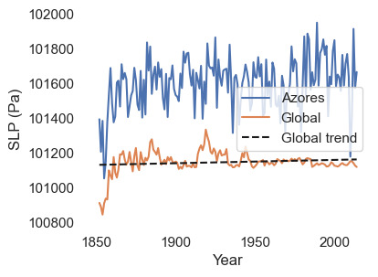
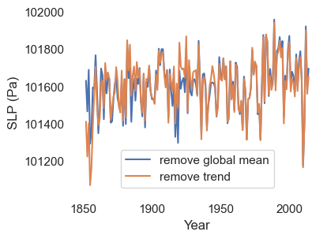
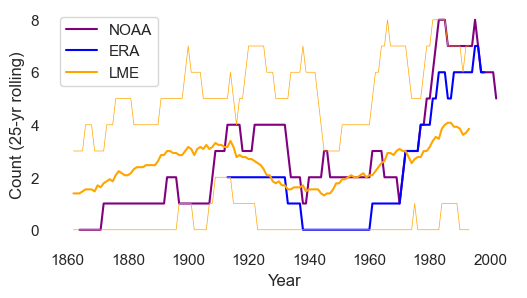
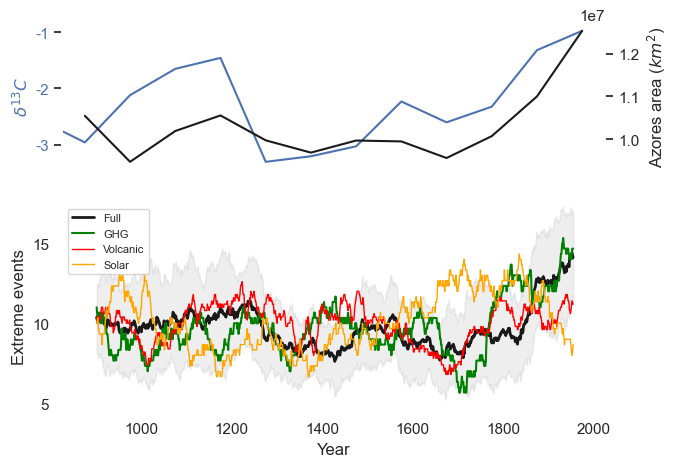
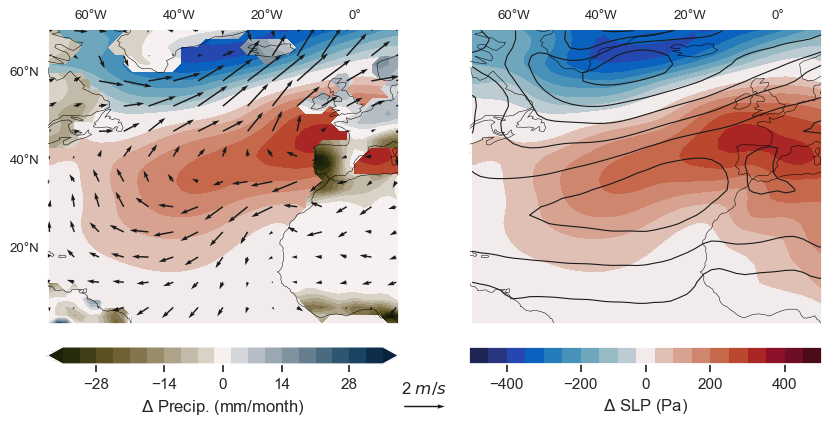

__Note__: to see the output of this notebook, see the [azores.md file](../../results/examples/azores/azores.md).

# Overview

__The goal__:  We're going to (loosely) reproduce results from Cresswell-Clay et al. (2022)$^1$ from scratch, using data stored on WHOI's CMIP server. 

__What did this study do?__  Cresswell-Clay et al. compared the observed expansion of the Azores High over the last $\sim$100 years with its variability on longer timescales. The central question is whether this expansion can be attributed to external forcing (e.g., greenhouse gas emissions) or could be explained by natural climate variability.

To address this question, Cresswell-Clay et al. compare the magnitude of the Azores High's recent expansion to its simulated variability in an ensemble of $\sim$1,200 year simulations from a global climate model (the Community Earth System Model Last-Millenium Ensemble, or CESM-LME). They also compare the model's reconstruction of Azores High extent over this period to a paleoclimate "proxy" (a $\sim$1200-year record of $\delta^{13}C$ obtained from a stalagmite in a Portuguese cave)$^2$. As suggested in the paper's title, the authors find the recent expansion is "unprecedented" and very unlikely to occur from natural climate variability.

__What is the Azores High?__ A "local maximum" of surface air pressure, located approximately over the Azores Islands (about 1,500 km west of Portugal, in the North Atlantic Ocean) during the winter months. 

__Why does it expansion matter?__ One reason: high pressure is associated with drier conditions (e.g., less rain). If the high pressure region expands, we might expect regions in the "expansion zone" to become drier.

__What are we going to do?__ We're going to reproduce versions of Figs. 1, 2c, and 3d-e, from scratch (the authors' original code is also available online$^3$). The goal is to provide a practical example of how to use reanalysis and climate model output to answer questions about climate. 

__References__  
$^1$Cresswell-Clay, N. et al. (2022). "Twentieth-century Azores High expansion unprecedented in the past 1,200 years". *Nat. Geosci.* 15, 548–553.  
$^2$Thatcher, D. L. et al. (2023) "Iberian hydroclimate variability and the Azores High during the last 1200 years: evidence from proxy records and climate model simulations". *Clim Dyn* 60, 2365–2387.  
$^3$https://github.com/nathanielcresswellclay/AzoresHighExpansion/tree/main

# Outline
This example is divided into three segments:
1. __Obtaining and pre-processing the data__: we'll load global data from WHOI's CMIP server,  "reduce" it by trimming in time and space, and save the pre-processed data locally. While not always possible, saving a reduced version of the data can speed up subsequent analysis: the code will run much faster if we can fit the data into "memory" (i.e., random access memory, or RAM).
2. __"Observed" expansion and model validation__: we'll plot the "observed" expansion of the Azores High – based on reanalysis output – and compare it to the expansion simulated by the CESM-LME over the overlapping period (approximately 1850-2005). The motivating question is: can we trust the model over the period where it *doesn't* overlap with observations?
3. __Analysis of model output and comparison to cave record__: we'll compare statistics between CESM-LME ensembles with different "external forcing". In particular, we'll look at four types of forcing: (a) greenhouse gas emissions, (b) orbital/solar variability, (c) volcanic activity, and (d) all of the above (denoted "Full" in the paper). We'll also compare the Azores High variability "Full" forcing scenario to the $\delta^{13}C$ variability in the Portuguese stalagmite.

# Packages


```python
import xarray as xr
import numpy as np
from tqdm import tqdm
import pandas as pd
import matplotlib.pyplot as plt
import seaborn as sns
import cartopy.crs as ccrs
import matplotlib as mpl
import cmocean
import os

## custom imports
import src.utils
import src.utils_azores

## Set plotting defaults
sns.set(rc={"axes.facecolor": "white", "axes.grid": False})
```

# Define constants/functions

__Last millenium ensemble (LME) data access__: If you don't have access to the "clidex" data server, download the LME folder from the shared google drive, and save it to your local project's data filepath, ```DATA_FP```.  

__Reanalysis data access__: Note that this script uses reanalysis data on the CMIP<b>5</b> server, rather than the CMIP<b>6</b> server.


```python
## Filepaths
# where to save data locally
DATA_FP = "/Users/theo/research/cmip-tutorial/data"

# path to LME data on clidex data server
fp_lme = "/vortex/clidex/data/model/CESM/LME/atm/psl"

# Path to "reanalysis" folder on CMIP5 server (will change
# based on where the server is mounted)
CMIP5_REANALYSIS_FP = "/Volumes/data/reanalysis"

# on cmip5 server
fp_slp_era = os.path.join(CMIP5_REANALYSIS_FP, "era.20c/sfc/msl/moda/msl.mon.mean.nc")
fp_slp_noaa = os.path.join(
    CMIP5_REANALYSIS_FP, "noaa.cires.20crv2c/monolevel/prmsl/monthly/prmsl.mon.mean.nc"
)

## 10m winds (NOAA 20C reanalysis)
fp_uv10_noaa = os.path.join(CMIP5_REANALYSIS_FP, "noaa.cires.20crv2c/gaussian")
fp_precip_noaa = os.path.join(
    CMIP5_REANALYSIS_FP, "noaa.cires.20crv2c/gaussian/prate/monthly/prate.mon.mean.nc"
)

# # also potentially useful:
# # (note: LME only has single ensemble member at the given directory)
# fp_lme = "/mnt/cmip5-data/CMIP5/output1/NCAR/CCSM4/past1000/mon/atmos/Amon/r1i1p1/psl/psl_Amon_CCSM4_past1000_r1i1p1_085001-185012.nc"
# fp_slp_era = "/vortexfs1/share/clidex/data/reanalysis/20CR/prmsl/prmsl.mon.mean.nc"
```

# Load data

## Datasets used:
- ERA-20C
- NOAA–CIRES 20CR
- HadSLP2
- CESM1 LME

### Functions for fetching 'raw' data from server


```python
def load_lme_member(forcing_type, member_id):
    """
    Function loads data from single member of CESM last-millenium ensemble (LME).
    Args:
    - 'member_id' is integer in [1,13] specifying which ensemble member to load
    - 'forcing_type' is one of {"all","volcanic","GHG","orbital"}
    """

    ## get prefix
    prefix = "b.e11.BLMTRC5CN.f19_g16"
    if forcing_type == "all":
        pass

    elif forcing_type == "GHG":
        prefix = f"{prefix}.GHG"

    elif forcing_type == "volcanic":
        prefix = f"{prefix}.VOLC_GRA"

    elif forcing_type == "orbital":
        prefix = f"{prefix}.ORBITAL"

    else:
        print("Error: not a valid forcing type")
        return

    ## add rest of prefix
    prefix = f"{prefix}.{member_id:03d}.cam.h0.PSL"

    ## Get names of two files for each ensemble member
    fp_and_prefix = os.path.join(fp_lme, prefix)
    fp0 = f"{fp_and_prefix}.085001-184912.nc"
    fp1 = f"{fp_and_prefix}.185001-200512.nc"

    ## Load data
    data = xr.open_mfdataset([fp0, fp1], chunks={"time": 2000})["PSL"]

    ## switch longitude range from [0,360) to (-180,180]
    data = src.utils.switch_longitude_range(data)

    return data


def load_noaa():
    """NOAA CIRES data and update coordinates"""

    ## open raw data and select PSL variable
    data = xr.open_dataset(fp_slp_noaa)["prmsl"]

    ## switch longitude range from [0,360) to (-180,180]
    data = src.utils.switch_longitude_range(data)

    ## reverse latitude direction from [90,-90] to [-90,90]
    data = src.utils.reverse_latitude(data)

    return data


def load_era():

    ## open raw data and select PSL file
    data = xr.open_dataarray(fp_slp_era)

    ## rename coordinates from "latitude" and "longitude"
    ## to "lat" and "lon"
    data = data.rename({"latitude": "lat", "longitude": "lon"})

    ## switch longitude range from [0,360) to (-180,180]
    data = src.utils.switch_longitude_range(data)

    ## reverse latitude direction from [90,-90] to [-90,90]
    data = src.utils.reverse_latitude(data)

    return data
```

### Functions to trim raw data and save locally


```python
## For each dataset, get DJF average and trim to North Atlantic
def trim(data):
    """function to trim a data in time and space, and save to file.
    Two datasets are returned:
    - data_trim (trimmed to north atlantic)
    - data_global_avg (global averaged of data)"""

    ## trim in time, then load to memory
    data_djf = src.utils.djf_avg(data).compute()

    ## trim in space
    data_trim = src.utils_azores.trim_to_north_atlantic(data_djf)

    ## get global average
    data_global_avg = src.utils.spatial_avg(data_djf)

    ## combine into single dataset
    data_prepped = xr.merge(
        [data_trim.rename("slp"), data_global_avg.rename("slp_global_avg")]
    )

    return data_prepped


def load_prepped_data(data_loader_fn, prep_fn, fp_out):
    """Function applies 'prep_fn' to data returned by 'data_loader_fn',
    and saves result to 'fp_out'.
    Args:
        - data_loader_fn: function to load raw data
        - prep_fn: function to pre-process raw data
        - fp_out: filepath to save pre-processed data
    """

    ## check if file exists
    if os.path.isfile(fp_out):

        ## Load pre-trimmed file
        data_prepped = xr.open_dataset(fp_out).compute()

    else:

        ## Load data, trim it, and save to file
        data = data_loader_fn()
        data_prepped = prep_fn(data)
        data_prepped.to_netcdf(fp_out)

    return data_prepped


def get_trimmed_data_lme(forcing_type, member_ids):
    """Process multiple ensemble members"""

    ## Loop through each ensemble member
    data_trimmed = []
    for member_id in tqdm(member_ids):

        ## get filepath for saving data
        fp_out = os.path.join(DATA_FP, "LME", f"LME_{forcing_type}_{member_id:03d}.nc")

        ## function to load the given ensemble member
        data_loader_fn = lambda: load_lme_member(forcing_type, member_id)

        ## load trimmed data
        data_trimmed_i = load_prepped_data(data_loader_fn, trim, fp_out)

        ## append result
        data_trimmed.append(data_trimmed_i)

    ## merge data from each ensemble member to single dataset
    ensemble_member_dim = pd.Index(member_ids, name="ensemble_member")
    data_trimmed = xr.concat(data_trimmed, dim=ensemble_member_dim)

    return data_trimmed


def get_trimmed_data(data_loader_fn, fp_out):
    return load_prepped_data(data_loader_fn=data_loader_fn, fp_out=fp_out, prep_fn=trim)
```

#### Load in trimmed data


```python
slp_noaa = get_trimmed_data(
    data_loader_fn=load_noaa, fp_out=os.path.join(DATA_FP, "slp_noaa.nc")
)
slp_era = get_trimmed_data(
    data_loader_fn=load_era, fp_out=os.path.join(DATA_FP, "slp_era.nc")
)
slp_lme = get_trimmed_data_lme(forcing_type="all", member_ids=np.arange(1, 14))
slp_lme_volc = get_trimmed_data_lme(forcing_type="volcanic", member_ids=np.arange(1, 6))
slp_lme_GHG = get_trimmed_data_lme(forcing_type="GHG", member_ids=np.arange(1, 4))
slp_lme_orb = get_trimmed_data_lme(forcing_type="orbital", member_ids=np.arange(1, 4))
```

    100%|██████████████████████████████████████████████████████████████████████████████████████████████████████████████████████████████████████████████████████████████████████| 13/13 [00:00<00:00, 126.70it/s]
    100%|████████████████████████████████████████████████████████████████████████████████████████████████████████████████████████████████████████████████████████████████████████| 5/5 [00:00<00:00, 135.37it/s]
    100%|████████████████████████████████████████████████████████████████████████████████████████████████████████████████████████████████████████████████████████████████████████| 3/3 [00:00<00:00, 134.98it/s]
    100%|████████████████████████████████████████████████████████████████████████████████████████████████████████████████████████████████████████████████████████████████████████| 3/3 [00:00<00:00, 139.01it/s]


# Compute AHA metric

From Cresswell-Clay et al. (2022): "The AHA was defined as the area (km2) over the North Atlantic and Western Europe that had mean winter (December–January–February) SLP greater than 0.5 s.d. from the mean of the spatio-temporal winter SLP distribution (Fig. 1b). The region considered when calculating the AHA is bounded by the 60° W and 10° E meridians as well as the 10° N and 52° N latitudes."

#### Plot SLP over time in dataset


```python
## specify which dataset to use
data = slp_noaa

## Compute SLP averaged over Azores region
slp_azores = src.utils.spatial_avg(src.utils_azores.trim_to_azores(data["slp"]))
slp_global = data["slp_global_avg"]

## get linear trend for global
global_trend = src.utils.get_trend(slp_global)

## Plot
fig, ax = plt.subplots(figsize=(4, 3))
ax.plot(data.year, slp_azores, label="Azores")
ax.plot(data.year, slp_global, label="Global")
ax.plot(data.year, global_trend, label="Global trend", c="k", ls="--")
ax.legend()
ax.set_xlabel("Year")
ax.set_ylabel("SLP (Pa)")
plt.show()

## Plot before/after normalizing
fig, ax = plt.subplots(figsize=(4, 3))
ax.plot(
    slp_noaa.year,
    (slp_azores - slp_global + slp_global.mean()),
    label="remove global mean",
)
ax.plot(
    data.year,
    (slp_azores - global_trend + global_trend.mean()),
    label="remove trend",
)
ax.legend()
ax.set_xlabel("Year")
ax.set_ylabel("SLP (Pa)")
plt.show()
```


    

    


    

    


#### Fig 2c: # of AHA extremes since ~1850


```python
## count extremes in reanalysis
count_noaa = src.utils_azores.count_extremes_wrapper(slp_noaa)
count_era = src.utils_azores.count_extremes_wrapper(slp_era)

## count in historical component of LME
slp_lme_hist = slp_lme.sel(year=slice(1850, None))
count_lme = src.utils_azores.count_extremes_wrapper(slp_lme_hist)

## get ensemble mean, min, and max
count_lme_mean = count_lme.mean("ensemble_member")
count_lme_min = count_lme.min("ensemble_member")
count_lme_max = count_lme.max("ensemble_member")

## make plot
fig, ax = plt.subplots(figsize=(6, 3))

## plot reanalysis
ax.plot(count_noaa.year, count_noaa, label="NOAA", c="purple")
ax.plot(count_era.year, count_era, label="ERA", c="blue")

## plot LME mean and range
count_lme_plot = ax.plot(count_lme.year, count_lme_mean, label="LME", c="orange")
for bound in [count_lme_min, count_lme_max]:
    ax.plot(bound.year, bound, c=count_lme_plot[0].get_color(), lw=0.5)

## label plot
ax.legend()
ax.set_xlabel("Year")
ax.set_ylabel("Count (25-yr rolling)")
plt.show()
```


    

    


### Fig. 3c,d: # of AHA extremes in LME

#### Get ensemble stats of extreme count in LME


```python
# Function to get extreme count
def count_fn(data):
    return src.utils_azores.count_extremes_wrapper(
        data, norm_type="global_mean", window=100
    )


# empty lists to hold results
ensemble_mean = []
ensemble_std = []

# list of datasets and labels to process
datasets = [slp_lme, slp_lme_GHG, slp_lme_volc, slp_lme_orb]
labels = ["Full", "GHG", "Volcanic", "Solar"]

## loop through datasets
for data, label in zip(datasets, labels):

    ## Count no. of extreme events
    count = count_fn(data).rename(label)

    ## get ensemble stats
    ensemble_mean.append(count.mean("ensemble_member"))
    ensemble_std.append(count.std("ensemble_member"))

## combine into single dataset
ensemble_mean = xr.merge(ensemble_mean)
ensemble_std = xr.merge(ensemble_std)
```

#### Compare Azores High area in LME to paleo data
Description of data here: https://www.ncei.noaa.gov/access/paleo-search/study/37160

Functions to load data:


```python
def load_paleo_data():
    """function to load Paleo data"""

    ## data is located at following link:
    fp = r"https://www.ncei.noaa.gov/pub/data/paleo/speleothem/europe/portugal/thatcher2022/thatcher2022-composite_isotope_records.txt"

    ## open dataset using Pandas
    paleo_data = pd.read_csv(fp, skiprows=117, sep=r"\s+").set_index("age_CE")

    ## convert to xarray and rename coordinate "year"
    paleo_data = paleo_data.to_xarray().rename({"age_CE": "year"})

    ## switch order of year coordinate so that it's increasing
    paleo_data = paleo_data.reindex({"year": paleo_data.year.values[::-1]})

    return paleo_data


def compute_AHA_ensemble_mean(slp_data):
    """function to compute ensemble mean of AHA index
    in LME with 'Full' forcing"""

    ## compute AHA for each ensemble member
    aha = src.utils_azores.compute_AHA(
        slp=slp_data["slp"],
        slp_global_avg=slp_data["slp_global_avg"],
        norm_type="global_mean",
    )

    ## compute ensemble mean
    aha_ensemble_mean = aha.mean("ensemble_member")

    return aha_ensemble_mean


def floor_nearest100(x):
    """rounds down to nearest 100"""

    return np.floor(x / 100) * 100


def bin_by_century(data, bin_offset=0):
    """
    Function to bin data by century. Args:
    - 'bin_offset' is number in [0, 100) representing
        where the first bin begins.
    """

    ## Get century to label data with
    century = floor_nearest100(data["year"] - bin_offset) + bin_offset

    ## add century as new coordinate on data
    ## (this makes it easy to group data by century)
    data = data.assign_coords({"century": century.astype(int)})

    # get mean for each century
    data_binned = data.groupby("century").mean()

    return data_binned
```

Load the data and compute century-binned averages


```python
## Load data
paleo_data = load_paleo_data()
aha_mean = compute_AHA_ensemble_mean(slp_data=slp_lme)

## Compute binned averages
offset = 25  # the first bin begins at year (800 + offset)
paleo_data_binned = bin_by_century(paleo_data, bin_offset=offset)
aha_mean_binned = bin_by_century(aha_mean, bin_offset=offset)
```

#### Plot results in style of paper
Plotting functions:


```python
def plot_LME_extremes(ax):
    """function to plot LME extremes on ax object"""

    ## specify colors and linestyles for each LME run
    labels = ["Full", "GHG", "Volcanic", "Solar"]
    colors = ["k", "green", "red", "orange"]
    scales = [1, 0.75, 0.5, 0.5]

    ## Plot lines one-by-one
    for label, color, scale in zip(labels, colors, scales):

        ## get linewidth based on scale
        mean_width = 2.0 * scale
        range_width = 0.5 * scale

        ## plot ensemble mean
        ax.plot(
            ensemble_mean.year,
            ensemble_mean[label],
            label=label,
            c=color,
            lw=mean_width,
        )

    ## plot standard deviation for "Full" run
    upper_bound = ensemble_mean["Full"] + ensemble_std["Full"]
    lower_bound = ensemble_mean["Full"] - ensemble_std["Full"]
    ax.fill_between(ensemble_mean.year, upper_bound, lower_bound, color="k", alpha=0.07)

    ## label plot
    ax.legend(prop={"size": 8})
    ax.set_xlabel("Year")
    ax.set_ylabel("Extreme events")
    ax.set_yticks([5, 10, 15])
    ax.set_ylim([None, 17.5])

    return ax


def plot_paleo_comparison(ax):
    """function to plot paleo data and AHA over time"""

    ## plot paleo data first
    paleo_plot = ax.plot(
        paleo_data_binned.century + 50, paleo_data_binned["d13C_compSuess"]
    )
    ax.set_ylabel(r"$\delta^{13}C$", c=paleo_plot[0].get_color())
    ax.set_yticks([-1, -2, -3], labels=[-1, -2, -3], color=paleo_plot[0].get_color())
    ax.set_xlim([825, 2025])

    ## plot AHA on same x-axis
    ax1 = ax.twinx()
    ax1.plot(aha_mean_binned.century + 50, aha_mean_binned, c="k")
    ax1.set_ylabel(r"Azores area ($km^2$)")
    ax1.set_yticks([1e7, 1.1e7, 1.2e7])

    return ax, ax1
```

Make plot:


```python
fig = plt.figure(figsize=(7, 5))
gs = mpl.gridspec.GridSpec(2, 1, height_ratios=[0.7, 1])

## plot binned paleo data and AHA over time
ax0 = fig.add_subplot(gs[0])
ax00, ax01 = plot_paleo_comparison(ax0)
ax00.set_xticks([])

## Plot extreme count over time
ax1 = fig.add_subplot(gs[1])
ax1 = plot_LME_extremes(ax1)

## make sure x-axes match
ax1.set_xlim(ax0.get_xlim())

plt.show()
```


    

    


# Spatial plots

#### Functions to compute and plot composite


```python
def make_composite(data, year_range0=[1950, 1979], year_range1=[1980, 2007]):
    """get composite, defined as difference between data
    when averaged over year_range1 and year_range0.
    """

    ## compute means
    mean1 = data.sel(year=slice(*year_range1)).mean("year")
    mean0 = data.sel(year=slice(*year_range0)).mean("year")

    return mean1 - mean0


def plot_setup_helper(ax, scale=1):
    """Create map background for plotting spatial data.
    Returns modified 'ax' object."""

    ## specify range and ticklabels for plot
    lon_range = [-70, 10]
    lat_range = [3, 70]
    xticks = [-60, -40, -20, 0]
    yticks = [20, 40, 60]

    ax, gl = src.utils.plot_setup(ax, lon_range, lat_range, xticks, yticks, scale)

    return ax, gl
```

#### Data loading functions


```python
def load_noaa_uv10():
    """Load NOAA U10 and V10 data (eastward and northward windspeed at 10m)"""

    ## load raw files for u and v
    u10_noaa = xr.open_dataset(
        os.path.join(fp_uv10_noaa, "uwnd.10m", "monthly", "uwnd.10m.mon.mean.nc")
    )
    v10_noaa = xr.open_dataset(
        os.path.join(fp_uv10_noaa, "vwnd.10m", "monthly", "vwnd.10m.mon.mean.nc")
    )

    ## merge into single dataset
    uv10_noaa = xr.merge([u10_noaa, v10_noaa])

    return uv10_noaa


def load_noaa_precip():
    """Load NOAA precipitation data from CMIP server.
    Returns xr.dataarray with units of mm"""

    ## load in precipitation rate (units: kg/m^2/s)
    precip_rate = xr.open_dataset(fp_precip_noaa)["prate"]

    ## change units to mm (millimeters)
    precip = update_precip_units(precip_rate).rename("precip")

    return precip


def update_precip_units(precip_rate):
    """change units of precipitation from (kg m^-2 s^-1) to mm
    by dividing by density of water and integrating in time"""

    ## Convert units from mass/area to height by dividing
    ## by density of liquid water:
    ## (km m^-2 s^-1) * (kg^-1 m^3) = m s^-1
    density_water = 1000  # units: kg m^-3
    precip_rate = precip_rate / density_water  # new units of m/s

    ## convert from month-averaged rate (units: m/s) to
    ## month total (units: m), by multiplyin by no. of seconds
    ## in each month. Units: (m s^-1) * s = m.
    ## Note: days_per_month depends on month (so is
    ## array, not a scalar, in the code below).
    days_per_month = precip_rate.time.dt.days_in_month
    seconds_per_day = 86400
    seconds_per_month = seconds_per_day * days_per_month
    precip = precip_rate * seconds_per_month

    ## convert units from m to mm
    mm_per_m = 1000
    precip = precip * mm_per_m

    return precip


def load_noaa_lsm():
    """Load NOAA land-sea mask for NOAA reanalysis"""

    ## load raw data
    url = r"http://psl.noaa.gov/thredds/dodsC/Datasets/20thC_ReanV2c/gaussian/time_invariant/land.nc"
    lsm = xr.open_dataset(url).isel(time=0, drop=True).compute()

    ## remove this attribute: causes issues with saving to netcdf
    del lsm.attrs["_NCProperties"]

    return lsm


def update_coords_noaa(data):
    """function to update coordinates of NOAA data"""

    data = src.utils.switch_longitude_range(data)
    data = src.utils.reverse_latitude(data)

    return data


def trim_noaa(data, djf_avg=True):
    """function to trim non-SLP NOAA data"""

    ## update coordinates before trimming
    data = update_coords_noaa(data)

    ## Get DJF average if variable is a function of time
    if "time" in data.coords:
        data = src.utils.djf_avg(data).compute()

    ## trim in space
    data = src.utils_azores.trim_to_north_atlantic(data)

    return data


def get_trimmed_data_noaa(data_loader_fn, fp_out):
    return load_prepped_data(
        data_loader_fn=data_loader_fn, prep_fn=trim_noaa, fp_out=fp_out
    )
```

#### Do the actual data loading


```python
uv10_noaa = get_trimmed_data_noaa(
    load_noaa_uv10, fp_out=os.path.join(DATA_FP, "uv10_noaa.nc")
)
precip_noaa = get_trimmed_data_noaa(
    load_noaa_precip, fp_out=os.path.join(DATA_FP, "precip_noaa.nc")
)
lsm_noaa = get_trimmed_data_noaa(
    load_noaa_lsm, fp_out=os.path.join(DATA_FP, "lsm_noaa.nc")
)

## update grid of SLP so we can compare it to other variables
slp_noaa_regrid = slp_noaa.interp(
    {"lon": lsm_noaa.lon, "lat": lsm_noaa.lat}, method="linear"
)

## merge variables into single dataset
data_noaa = xr.merge([slp_noaa_regrid, uv10_noaa, precip_noaa])
```

#### Compute composite and climatology


```python
## compute composite and climatology
comp = make_composite(data_noaa)
clim = data_noaa.sel(year=slice(1950, 2007)).mean("year")
```

#### Plotting functions


```python
## functions to plot individual variables on plotting background.
## these functions take in an 'ax' object
def plot_precip(fig, ax):
    """plot precipitation composite"""

    ## plot data
    precip_plot = ax.contourf(
        comp.lon,
        comp.lat,
        comp["precip"],
        cmap="cmo.diff_r",
        levels=src.utils.make_cb_range(35, 3.5),
        extend="both",
    )

    ## add colorbar
    precip_cb = fig.colorbar(
        precip_plot,
        pad=0.05,
        ax=ax,
        orientation="horizontal",
        label=r"$\Delta$ Precip. (mm/month)",
        ticks=np.arange(-28, 42, 14),
    )

    return


def plot_slp(fig, ax, mask=False, add_colorbar=False):
    """Plot SLP. If mask==True, mask values over land"""

    ## mask data if specified
    if mask:
        plot_data = comp["slp"].where(lsm_noaa["land"] < 1)
    else:
        plot_data = comp["slp"]

    slp_plot = ax.contourf(
        comp.lon,
        comp.lat,
        plot_data,
        cmap="cmo.balance",
        levels=src.utils.make_cb_range(500, 50),
        transform=ccrs.PlateCarree(),
    )

    ## add colorbar if desired
    if add_colorbar:
        slp_cb = fig.colorbar(
            slp_plot,
            ax=ax,
            pad=0.05,
            orientation="horizontal",
            label=r"$\Delta$ SLP (Pa)",
            ticks=np.arange(-400, 600, 200),
        )

    return


def plot_slp_clim(fig, ax):
    """Plot SLP. If mask==True, mask values over land"""

    slp_plot_clim = ax.contour(
        clim.lon,
        clim.lat,
        clim["slp"],
        colors="k",
        levels=np.arange(99600, 102400, 400),
        linewidths=0.8,
    )

    return


def plot_wind(fig, ax, n=3):
    """Plot low-level wind. Plot every 'n'th vector to avoid overcrowding"""

    # get grid for plotting
    xx, yy = np.meshgrid(comp.lon.values[::n], comp.lat.values[::n])

    # plot the vectors
    wind_plot = ax.quiver(
        xx, yy, comp["uwnd"].values[::n, ::n], comp["vwnd"].values[::n, ::n]
    )

    # add legend
    wind_legend = ax.quiverkey(wind_plot, X=1.07, Y=-0.28, U=2, label=r"2 $m/s$")

    return
```

#### Make plot


```python
## Create figure
fig = plt.figure(figsize=(10, 6))

## add first plotting background
ax0 = fig.add_subplot(1, 2, 1, projection=ccrs.PlateCarree())
ax0, gl0 = plot_setup_helper(ax0, scale=1.2)

## plot precip in colors over land:
plot_precip(fig, ax0)
plot_slp(fig, ax0, mask=True)
plot_wind(fig, ax0, n=3)

## add second plotting background, and remove left longitude labels
ax1 = fig.add_subplot(1, 2, 2, projection=ccrs.PlateCarree())
ax1, gl1 = plot_setup_helper(ax1, scale=1.2)
gl1.left_labels = False

## for SLP: plot composite in colors and climatology in contours
plot_slp(fig, ax1, add_colorbar=True)
plot_slp_clim(fig, ax1)

plt.show()
```


    

    

