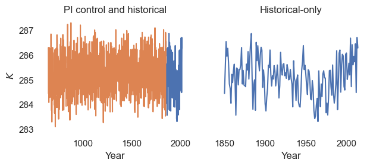
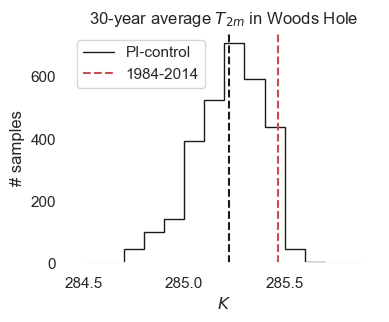

## Part 1: Set filepaths

### Check if we're running in Google Colab
If you are running in Google Colab, you may have to run the cell below twice because the kernel crashes; I'm not sure why this happens.


```python
## check if we're in Colab
try:
    import google.colab

    ## install cftime package
    !pip install -q condacolab
    import condacolab

    condacolab.install()

    ## install extra packages to colab environment
    !mamba install -c conda-forge cftime

    ## connect to Google Drive
    from google.colab import drive

    drive.mount("/content/drive")

    ## flag telling us the notebook is running in Colab
    IN_COLAB = True

except:
    IN_COLAB = False
```

### <mark>To-do</mark>: update filepaths
__To run this notebook, you'll need to update the filepaths below__, which specify the location of the data (otherwise, you'll get a ```FileNotFoundError``` message when you try to open the data). These filepaths will differ for Mac vs. Windows users and depend on how you've accessed the data (e.g., mounting the WHOI file server or downloading the data).


```python
if IN_COLAB:

    ## These are the paths to update if you're using Google Colab.
    ## 'hist_path' is filepath for historical data.
    ## 'pico_path' is filepath for pre-industrial control data
    hist_path = "/content/drive/My Drive/climate-data"
    pico_path = "/content/drive/My Drive/climate-data/tas_Amon_CESM2_piControl"

else:

    ## These are the paths to update if you're not using Google Colab.
    hist_path = (
        "/Volumes/cmip6/data/cmip6/CMIP/NCAR/CESM2/historical/r1i1p1f1/Amon/tas/gn/1"
    )

    pico_path = (
        "/Volumes/cmip6/data/cmip6/CMIP/NCAR/CESM2/piControl/r1i1p1f1/Amon/tas/gn/1"
    )
```

### Import packages


```python
import xarray as xr
import numpy as np
import os
import time
import tqdm
import glob
import matplotlib.pyplot as plt
import seaborn as sns
import pandas as pd

## set default plot style
sns.set(rc={"axes.facecolor": "white", "axes.grid": False})

## initialize random number generator
rng = np.random.default_rng()
```

## Part 2: Open CESM data and compute the WH index

### Pre-processing function.
This function should trim the data in lon/lat space. We'll use this function to reduce the amount of data we need to load into memory


```python
def trim(data):
    """
    Trim data in lon/lat space to a region around Woods Hole.
    Woods Hole has (lon,lat) coords of approximately (288.5, 41.5).

    Args:
        data: xr.DataArray object

    Returns:
        data_trimmed : xr.DataArray object
    """

    ## Trim the data in lon/lat space
    data_trimmed = data.sel(lon=slice(270, 310), lat=slice(20, 60))

    return data_trimmed
```

### Open *historical* data.
We'll open the data from the historical simulation, trim it using the ```trim``` function from above, and load it into memory. Note that without ```mask_and_scale=False``` you may get a warning related to NaN fill values.


```python
## filename for the historical simulation data
hist_filename = "tas_Amon_CESM2_historical_r1i1p1f1_gn_185001-201412.nc"

## 'full' path to the data
hist_full_path = os.path.join(hist_path, hist_filename)

## open the data
T2m_hist = xr.open_dataset(hist_full_path, mask_and_scale=False)

## trim in space
T2m_hist = trim(T2m_hist).compute()

## select 'tas' variable and load into memory
T2m_hist = T2m_hist["tas"].compute()
```

### Open *PI control* data
We'll do this using ```xr.open_mfdataset```. To speed up the data-loading process, we'll pass the pre-processing function ```trim``` as an argument to ```xr.open_mfdataset```.


```python
## Get file pattern of files to load
file_pattern = os.path.join(pico_path, "*.nc")

## Now, open the dataset
T2m_pico = xr.open_mfdataset(file_pattern, preprocess=trim, mask_and_scale=False)

## Finally, load it into memory
T2m_pico = T2m_pico["tas"].compute()
```

### Compute Woods Hole "climate index"

First, we'll write a function to compute the index. Then, we'll apply it to both datasets.


```python
def WH_index(T2m):
    """Function to compute 'Woods Hole climate index. We'll define
    this index as the annual-average temperature in the gridcell
    closest to the (lon, lat) point (288.5, 41.5).

    Args:
        T2m: xr.DataArray with dimensions (lon, lat, time)

    Returns:
        T2m_WH: xr. DataArray with dimension (year)
    """

    ## first, interpolate close to Woods Hole
    T2m_WH = T2m.interp(lat=41.5, lon=288.5, method="nearest")

    ## then, get annual average
    T2m_WH = T2m_WH.groupby("time.year").mean()

    return T2m_WH


## Next, apply it to the datasets
T2m_WH_hist = WH_index(T2m_hist)
T2m_WH_pico = WH_index(T2m_pico)
```

### Plot the two timeseries


```python
## blank canvas for plotting
fig, axs = plt.subplots(1, 2, figsize=(7, 2.5))

#### First subplot: PI control and historical
axs[0].set_title("PI control and historical")
axs[0].set_xlabel("Year")
axs[0].set_ylabel(r"$K$")

## first, plot the historical timeseries
axs[0].plot(T2m_WH_hist.year, T2m_WH_hist, label="Hist.")

## next, plot the PI-control - the year is arbitrary
## (becuase the model's external forcing is constant),
## so let's shift the year by 650 years. This means
## the last year in the PI-control simulation is the
## same as the first year in the historical simulation
## (and will make it easier to compare the two in a plot).
axs[0].plot(T2m_WH_pico.year + 650, T2m_WH_pico, label="PI co.")


#### Second subplot: only show historical simulation
axs[1].set_title("Historical-only")
axs[1].set_xlabel("Year")

## plot data
axs[1].plot(T2m_WH_hist.year, T2m_WH_hist, label="Hist.")

## make sure ylimit matches first subplot, then hide it
axs[1].set_ylim(axs[0].get_ylim())
axs[1].set_yticks([])

plt.show()
```


    

    


## Part 3: draw random samples from PI-control

### <mark>To-do:</mark> write function to draw *one* sample
We're going to estimate the probability distribution for 
the PI-control run by drawing lots of random samples (with replacement). Let's start by __writing a function which draws a single random sample__ of length ```nyears``` and computes the mean


```python
def get_sample_mean(data, nyears):
    """
    Function draws a random sample from given dataset,
    and averages over period.
    Args:
        'data': xr.DataArray to draw samples from 
        'nyears': integer specifying how many years in each sample
        
    Returns:
        'sample_mean': xr.DataArray containing mean of single sample
    """

    ## Select start/end years for the sample
    possible_start_years = data.year[:-nyears]
    start_year = rng.choice(possible_start_years)
    end_year = start_year + nyears

    ## Select the sample
    sample = data.sel(year=slice(start_year, end_year))

    ## compute sample mean
    sample_mean = sample.mean("year")

    return sample_mean
```

### <mark>To-do:</mark> write function to draw *multiple* samples


```python
def get_sample_means(data, nsamples, nyears=30):
    """
    Function draws multiple random samples, by 
    repeatedly calling the 'get_sample_mean' function.
    Args:
        'data': xr.DataArray to draw samples from
        'nsamples': number of samples to draw
        'nyears': number of years in each sample

    Returns:
        'sample_means' xr.DataArray containing mean for each sample
        
    """

    ## initialize empty list to hold sample means
    sample_means = []

    ## do the simulations inside a loop
    for _ in range(nsamples):

        ## select a random sample
        sample_means.append(get_sample_mean(data, nyears))

    ## concatenate list into xarray
    sample_means = xr.concat(sample_means, dim="sample")
    
    return sample_means
```

### <mark>To-do</mark>: apply this function to get 3,000 random samples.


```python
## To-do
sample_means = get_sample_means(data=T2m_WH_pico, nsamples=3000)
```

## Part 4: Make a histogram

### Compute histogram of sample means
Below, we'll manually specify the edges of each bin in the histogram.


```python
bin_width = 0.1
bin_edges = np.arange(284.5, 286, bin_width)
histogram_pico, _ = np.histogram(sample_means, bins=bin_edges)
```

### <mark>To-do:</mark> compute value in *historical* run
Specifically, we'll also compute mean value of the WH index in the historical simulation over the last 30 years.


```python
## To-do: get mean of last 30 years of historical simulation
T2m_last30 = T2m_WH_hist.isel(year=slice(-30,None)).mean()
```

### Plot the result below


```python
## blank canvas for plotting
fig, ax = plt.subplots(figsize=(4, 3))

## plot the histogram
ax.stairs(values=histogram_pico, edges=bin_edges, color="k", label="PI-control")

## plot mean value in PI-Control
ax.axvline(sample_means.mean(), c="k", ls="--")

## plot mean value in last ~30 years for historical
ax.axvline(T2m_last30, c="r", ls="--", label=r"1984-2014")

## label the plot
ax.set_ylabel("# samples")
ax.set_xlabel(r"$K$")
ax.set_title(r"30-year average $T_{2m}$ in Woods Hole")
ax.legend()

plt.show()
```


    

    

