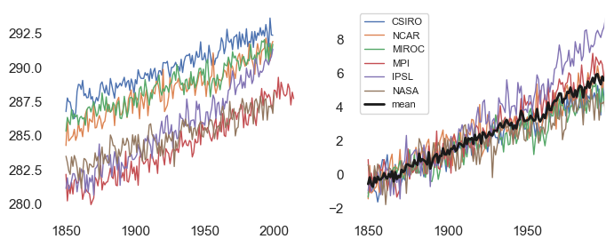

## Check if we're running in Google Colab
If you are running in Google Colab, you may have to run the cell below twice because the kernel crashes; I'm not sure why this happens.


```python
## check if we're in Colab
try:
    import google.colab

    ## install cftime package
    !pip install -q condacolab
    import condacolab

    condacolab.install()

    ## install extra packages to colab environment
    !mamba install -c conda-forge cftime

    ## connect to Google Drive
    from google.colab import drive

    drive.mount("/content/drive")

    ## flag telling us the notebook is running in Colab
    IN_COLAB = True

except:
    IN_COLAB = False
```

## Packages


```python
import xarray as xr
import cftime
import os.path
import pandas as pd
import numpy as np
import time
import matplotlib.pyplot as plt
import seaborn as sns

sns.set(rc={"axes.facecolor": "white", "axes.grid": False})
```

## <mark>To-do:</mark> Filepaths


```python
if IN_COLAB:

    ## Get prefix common to all filepaths
    prefix = "/content/drive/My Drive/climate-data/1pctCO2"

    ## function to add prefix to path
    add_prefix = lambda path: os.path.join(prefix, path)

    ## finally, a dictionary with the filepaths
    fp_dict = {
        "CSIRO": add_prefix("CSIRO"),
        "NCAR": add_prefix("NCAR"),
        "MIROC": add_prefix("MIROC"),
        "MPI": add_prefix("MPI"),
        "IPSL": add_prefix("IPSL"),
        "NASA": add_prefix("NASA"),
    }

else:

    ## Get prefix common to all filepaths
    prefix = "/Volumes/cmip6/data/cmip6/CMIP"

    ## function to add prefix to path
    add_prefix = lambda path: os.path.join(prefix, path)

    ## finally, a dictionary with the filepaths
    fp_dict = {
        "CSIRO": add_prefix("CSIRO/ACCESS-ESM1-5/1pctCO2/r1i1p1f1/Amon/tas/gn/1"),
        "NCAR": add_prefix("NCAR/CESM2/1pctCO2/r1i1p1f1/Amon/tas/gn/1"),
        "MIROC": add_prefix("MIROC/MIROC6/1pctCO2/r1i1p1f1/Amon/tas/gn/1"),
        "MPI": add_prefix("MPI-M/MPI-ESM1-2-LR/1pctCO2/r1i1p1f1/Amon/tas/gn/1"),
        "IPSL": add_prefix("IPSL/IPSL-CM6A-LR/1pctCO2/r1i1p1f1/Amon/tas/gr/1"),
        "NASA": add_prefix("NASA-GISS/GISS-E2-2-G/1pctCO2/r1i1p1f1/Amon/tas/gn/1"),
    }

## Get list of models
models = list(fp_dict)
```

## Climate index function


```python
def WH_index(T2m):
    """Function to compute 'Woods Hole climate index. We'll define
    this index as the annual-average temperature in the gridcell
    closest to the (lon, lat) point (288.5, 41.5).

    Args:
        T2m: xr.DataArray with dimensions (lon, lat, time)

    Returns:
        T2m_WH: xr. DataArray with dimension (year)
    """

    ## first, interpolate close to Woods Hole
    T2m_WH = T2m.interp(lat=41.5, lon=288.5, method="nearest")

    ## then, get annual average
    T2m_WH = T2m_WH.groupby("time.year").mean()

    return T2m_WH
```

## <mark>To-do:</mark> Compute climate index on each dataset
Obtain a list of xr.DataArrays, ```T2m_idx```, where each item in the list represents the climate index timeseries for one of the models. A few hints:
- use ```xr.open_mfdataset```
    - use the ```preprocess``` argument
    - set ```use_cftime=True```, ```mask_and_scale=False```


```python
## empty list to hold result
T2m_idx = []

## loop through each (model, filepath) pair
for model, fp in fp_dict.items():

    ## get file pattern
    file_pattern = os.path.join(fp, "*.nc")

    ## open dataset and append to list
    T2m_idx.append(
        xr.open_mfdataset(
            os.path.join(fp, "*.nc"),
            use_cftime=True,
            mask_and_scale=False,
            preprocess=WH_index,
        )["tas"]
    )
```

## <mark>To-do:</mark> Combine into single dataarray
Hint: not all of the items in the list are labeled with the same years. We have to match them before combining.


```python
def reset_year(T2m):
    """Function to reset year to start at 1850"""

    ## get new time index
    updated_year = np.arange(1850, 1850 + len(T2m.year))

    ## add to array
    T2m["year"] = updated_year

    return T2m


## concatenate in dataset
T2m_idx = [reset_year(x) for x in T2m_idx]
T2m_idx = xr.concat(T2m_idx, dim=pd.Index(models, name="model"), coords="minimal")

## Drop unnecessary coordinates
T2m_idx = T2m_idx.drop_vars(["height", "lon", "lat"])

## Load into memory
start = time.time()
T2m_idx.load()
end = time.time()
print(end - start)
```

    264.6264081001282


## <mark>To-do</mark> Get a normalized version of the data 
To do this, subtract the mean of the first 30 years for each model.


```python
## normalize by removing mean of first 30 years
T2m_idx_baseline = T2m_idx.isel(year=slice(None, 30)).mean("year")
T2m_idx_norm = T2m_idx - T2m_idx_baseline
```

## <mark>To-do:</mark> Plot results


```python
fig, axs = plt.subplots(1, 2, figsize=(8, 3))

## first, plot the raw data; then, plot the normalized data
for i, data in enumerate([T2m_idx, T2m_idx_norm]):

    ## loop through each model
    for model in data.model:

        axs[i].plot(data.year, data.sel(model=model), label=model.item(), lw=1)

## plot ensemble mean
axs[1].plot(data.year, data.mean("model"), label="mean", lw=2, c="k")
axs[1].set_xlim([None, 1999])

## add legend
axs[1].legend(prop={"size": 8})

plt.show()
```


    

    

