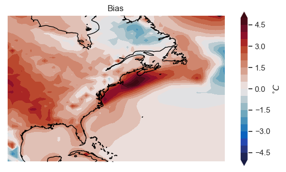

See the section on "model validation" in the [docs/task_list.md](../../docs/task_list.md) file for instructions for this tutorial. A solution is provided in [here (in the reults folder)](../../results/tutorials/model_validation/model_validation.md).

## Check if we're in Google Colab


```python
## check if we're in Colab
try:
    import google.colab

    ## install package that allows us to use mamba in Colab
    !pip install -q condacolab
    import condacolab

    condacolab.install()

    ## install extra packages to colab environment
    !mamba install -c conda-forge python=3.10.13 cmocean xesmf cartopy cftime cartopy

    ## connect to Google Drive (will prompt you to ask for permissions)
    from google.colab import drive

    drive.mount("/content/drive")

    ## flag telling us the notebook is running in Colab
    IN_COLAB = True

except:
    IN_COLAB = False
```

## Filepaths


```python
if IN_COLAB:

    ## filepaths for 2m-Temperature data
    era5_t2m_path = "/content/drive/My Drive/climate-data/era5/2m_temperature"
    cesm_t2m_path = "/content/drive/My Drive/climate-data"

else:

    ## filepaths for 2m-temperature data
    era5_t2m_path = (
        "/Volumes/cmip6/data/era5/reanalysis/single-levels/monthly-means/2m_temperature"
    )
    cesm_t2m_path = (
        "/Volumes/cmip6/data/cmip6/CMIP/NCAR/CESM2/historical/r1i1p1f1/Amon/tas/gn/1"
    )
```

## Imports


```python
import xarray as xr
import numpy as np
import pandas as pd
from tqdm import tqdm
import matplotlib.pyplot as plt
import cmocean
import seaborn as sns
import glob
import cftime
import cartopy.crs as ccrs
import matplotlib.ticker as mticker
import matplotlib.dates as mdates
import os

## set plotting style
sns.set(rc={"axes.facecolor": "white", "axes.grid": False})

## initialize random number generator
rng = np.random.default_rng()
```

## Open data


```python
## open ERA5 data
file_pattern = os.path.join(era5_t2m_path,"*.nc")
T2m_era = xr.open_mfdataset(file_pattern)["t2m"]

## open CESM2 data
cesm_fname = "tas_Amon_CESM2_historical_r1i1p1f1_gn_185001-201412.nc"
cesm_t2m_path_full = os.path.join(cesm_t2m_path, cesm_fname)
T2m_cesm = xr.open_dataset(cesm_t2m_path_full)["tas"]
```

    /Users/theo/research/cmip-tutorial/envs/lib/python3.12/site-packages/xarray/conventions.py:286: SerializationWarning: variable 'tas' has multiple fill values {1e+20, 1e+20} defined, decoding all values to NaN.
      var = coder.decode(var, name=name)


## Subset data in time and space


```python
## subset both datasets in time
time_range=["1979","2014"]

T2m_era = T2m_era.sel(time=slice(*time_range))
T2m_cesm = T2m_cesm.sel(time=slice(*time_range))


## subset CESM2 in space
lon_range = [258, 318]
lat_range = [20, 60]

## subset CESM2
T2m_cesm = T2m_cesm.sel(lon=slice(*lon_range), lat=slice(*lat_range))
```

#### Regrid ERA5 to match CESM2


```python
## update ERA5 coordinate names to match CESM2
T2m_era = T2m_era.rename({"latitude":"lat","longitude":"lon"})

## interpolate ERA5 onto CESM2's grid
T2m_era = T2m_era.interp({"lat":T2m_cesm.lat, "lon":T2m_cesm.lon})
```

## Compute and plot bias


```python
## compute bias
bias = T2m_cesm.mean("time") - T2m_era.mean("time")

## plot bias
## Blank canvas for plotting
fig = plt.figure(figsize=(7,4))

## add background map
ax = fig.add_subplot(projection=ccrs.PlateCarree())

## draw coastlines
ax.coastlines()

## set plot boundaries
ax.set_extent([*lon_range, *lat_range], crs=ccrs.PlateCarree())

## Plot the data (filled contour plot)
plot_data = ax.contourf(
    bias.lon, 
    bias.lat, 
    bias, 
    cmap="cmo.balance", # name of colormap
    levels=np.arange(-5,5.5,.5), # contour levels
    transform=ccrs.PlateCarree(), # 'transform' arg. required for plotting on map
    extend="both", # specifies how to handle out-of-range values in colorbar
)

## Add a colorbar and title
fig.colorbar(plot_data, label=r"$^{\circ}C$")
ax.set_title("Bias")

## render the plot
plt.show()
```


    

    

