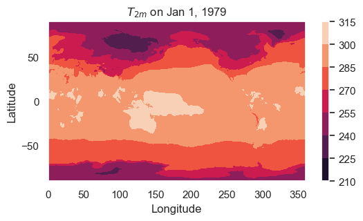
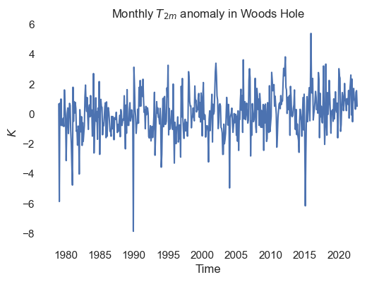

See the section on "defining a climate index" in the [docs/task_list.md](../../docs/task_list.md) file for instructions for this tutorial. A solution is provided in the [results folder](results/woodshole_climate_index/woodshole_climate_index.md).

## Check if we're in Google Colab


```python
## check if we're in Colab
try:
    import google.colab

    ## install package that allows us to use mamba in Colab
    !pip install -q condacolab
    import condacolab

    condacolab.install()

    ## install extra packages to colab environment
    !mamba install -c conda-forge python=3.10.13 cmocean xesmf cartopy cftime cartopy

    ## connect to Google Drive (will prompt you to ask for permissions)
    from google.colab import drive

    drive.mount("/content/drive")

    ## flag telling us the notebook is running in Colab
    IN_COLAB = True

except:
    IN_COLAB = False
```

## Filepaths


```python
if IN_COLAB:

    ## path to ERA5 reanalysis 2m-temperature data
    era5_t2m_path = "/content/drive/My Drive/climate-data/era5/2m_temperature"

    ## path to ERA5 reanalysis sea level pressure data
    era5_slp_path = "/content/drive/My Drive/climate-data/era5/mean_sea_level_pressure"

    ## path to MIROC6 SST data
    miroc6_path = "/content/drive/My Drive/climate-data"

else:

    ## path to ERA5 reanalysis 2m-temperature data
    era5_t2m_path = (
        "/Volumes/cmip6/data/era5/reanalysis/single-levels/monthly-means/2m_temperature"
    )

    ## path to ERA5 reanalysis sea level pressure data
    era5_slp_path = "/Volumes/cmip6/data/era5/reanalysis/single-levels/monthly-means/mean_sea_level_pressure"

    ## path to MIROC6 sea surface temperature data
    miroc6_path = (
        "/Volumes/cmip6/data/cmip6/CMIP/MIROC/MIROC6/historical/r1i1p1f1/Omon/tos/gn/1"
    )
```

## Imports


```python
import xarray as xr
import numpy as np
import pandas as pd
from tqdm import tqdm
import matplotlib.pyplot as plt
import cmocean
from matplotlib.dates import DateFormatter
import seaborn as sns
import glob
import cftime
import cartopy.crs as ccrs
import matplotlib.ticker as mticker
import matplotlib.dates as mdates
import os.path

## set plotting style
sns.set(rc={"axes.facecolor": "white", "axes.grid": False})

## initialize random number generator
rng = np.random.default_rng()
```

## Open the data


```python
file_pattern = os.path.join(era5_t2m_path, "*.nc")
t2m = xr.open_mfdataset(file_pattern)["t2m"]
```

#### Plot first timestep


```python
fig,ax = plt.subplots(figsize=(6,3))

## plot the data
plot_data = ax.contourf(t2m.longitude, t2m.latitude, t2m.isel(time=0))

## add colorbar
cb = fig.colorbar(plot_data)

## add labels
ax.set_xlabel("Longitude")
ax.set_ylabel("Latitude")
ax.set_title(r"$T_{2m}$ on Jan 1, 1979")

plt.show()
```


    

    


## Defining the index


```python
t2m_WH = t2m.sel(latitude=41.5, longitude=288.5)
t2m_WH_monthly_avg = t2m_WH.groupby("time.month").mean()
climate_index = t2m_WH.groupby("time.month") - t2m_WH_monthly_avg
```

    /Users/theo/research/cmip-tutorial/envs/lib/python3.12/site-packages/xarray/core/indexing.py:1617: PerformanceWarning: Slicing with an out-of-order index is generating 44 times more chunks
      return self.array[key]


#### Plot result


```python
fig, ax = plt.subplots(figsize=(6,4))

## plot data
ax.plot(climate_index.time, climate_index)

## label
ax.set_ylabel(r"$K$")
ax.set_xlabel("Time")
ax.set_title(r"Monthly $T_{2m}$ anomaly in Woods Hole")

plt.show()
```


    

    

